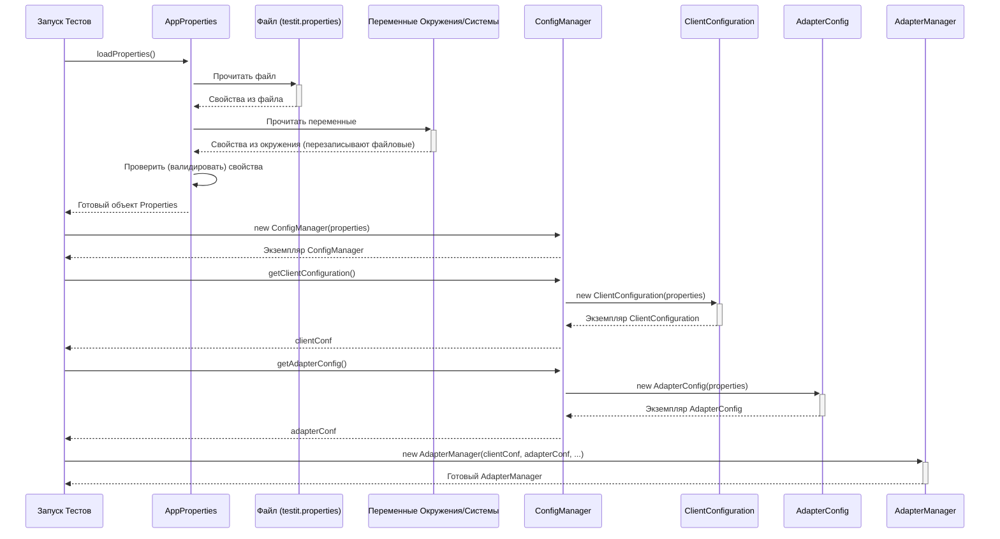

# Chapter 2: Конфигурация Адаптера и Клиента (AdapterConfig, ClientConfiguration)


В [предыдущей главе](01_менеджер_адаптера.md) мы познакомились с [Менеджером Адаптера (AdapterManager)](01_менеджер_адаптера.md) — главным дирижером нашего оркестра тестов. Мы узнали, что он управляет всем процессом сбора и отправки результатов. Но как `AdapterManager` узнает, *куда* отправлять результаты (адрес Test IT) и *как* именно ему работать (например, создавать ли новые тест-кейсы автоматически)? Для этого и существуют специальные конфигурационные классы: `ClientConfiguration` и `AdapterConfig`.

Представьте, что вы купили новый умный пылесос. Прежде чем он начнет убирать, вам нужно его настроить: подключить к Wi-Fi (сказать ему *куда* подключаться) и, возможно, задать расписание уборки или указать запретные зоны (сказать ему, *как* работать). Наши конфигурационные классы — это как раз такие "пульты управления" для адаптера.

## Зачем нужна конфигурация?

Адаптеру нужно знать две основные вещи:

1.  **Как подключиться к Test IT?** Где находится ваш сервер Test IT, какой секретный ключ использовать для доступа, в какой проект и конфигурацию загружать результаты? Без этой информации адаптер просто не сможет отправить данные.
2.  **Как адаптеру себя вести?** Должен ли он пытаться автоматически создать тест-кейс в Test IT, если для автотеста его еще нет? Нужно ли фильтровать тесты по списку из тест-рана Test IT или отправлять результаты всех запущенных тестов?

Эти настройки могут меняться от проекта к проекту или даже между разными запусками тестов. Поэтому их выносят в отдельные конфигурационные сущности, чтобы их было легко менять, не трогая код самих тестов или адаптера.

## Два вида настроек: `ClientConfiguration` и `AdapterConfig`

Адаптер разделяет настройки на две логические группы, которые хранятся в двух разных классах:

### 1. `ClientConfiguration`: Настройки подключения к Test IT

Этот класс хранит все, что нужно для "внешней" связи — для подключения к вашему экземпляру Test IT. Думайте об этом как об **адресной книге и ключе доступа**:

*   `url`: Адрес вашего сервера Test IT (например, `https://demo.testit.software`).
*   `privateToken`: Ваш секретный API-ключ для авторизации в Test IT. **Важно:** Храните его в секрете!
*   `projectId`: Уникальный идентификатор (UUID) вашего проекта в Test IT.
*   `configurationId`: Уникальный идентификатор (UUID) конфигурации внутри проекта Test IT (например, "Chrome, Win10").
*   `testRunId`: (Не всегда обязателен) Идентификатор (UUID) конкретного тест-рана, в который нужно загружать результаты.
*   `testRunName`: (Необязательно) Имя для нового тест-рана, если адаптер должен создать его сам.
*   `certValidation`: Включить или выключить проверку SSL-сертификата сервера Test IT.
*   `automaticUpdationLinksToTestCases`: (Необязательно) Обновлять ли автоматически связи между автотестами и тест-кейсами в Test IT.

**Аналогия:** `ClientConfiguration` — это как заполнить адрес на посылке: кому (проект), куда (URL), и специальный пропуск для курьера (токен).

### 2. `AdapterConfig`: Настройки поведения адаптера

Этот класс определяет "внутренние" правила работы самого адаптера. Это как **инструкция по эксплуатации** или правила игры:

*   `adapterMode`: Режим работы адаптера. Основные режимы:
    *   `0` (USE\_FILTER): Загружать результаты только для тестов, которые есть в указанном `testRunId` (фильтрация).
    *   `1`: Загружать результаты *всех* выполненных тестов в указанный `testRunId` (без фильтрации).
    *   `2`: Создать *новый* тест-ран (используя `testRunName`, если он задан) и загрузить туда результаты всех тестов.
*   `automaticCreationTestCases`: Создавать ли автоматически новые тест-кейсы в Test IT для автотестов, у которых еще нет связи? (значение `true` или `false`).
*   `tmsIntegration`: Глобальный "выключатель". Если `false`, адаптер вообще не будет пытаться связаться с Test IT. Полезно для локальных отладочных запусков. (значение `true` или `false`).

**Аналогия:** `AdapterConfig` — это как выбрать режим работы для вашего пылесоса: "уборка всей квартиры", "только кухня" или "турбо-режим".

## Как задать эти настройки? Файл `testit.properties`

Самый распространенный способ задать все эти параметры — создать файл `testit.properties` в папке ресурсов (`src/main/resources` или `src/test/resources`) вашего проекта.

Вот пример такого файла:

```properties
# Настройки для ClientConfiguration (Подключение к Test IT)
url=https://your-testit-instance.com
privateToken=ВАШ_СУПЕР_СЕКРЕТНЫЙ_ТОКЕН
projectId=a1b2c3d4-e5f6-7890-1234-567890abcdef
configurationId=b2c3d4e5-f6a7-8901-2345-67890abcdef1

# Опционально: ID существующего тест-рана (для adapterMode 0 или 1)
# testRunId=c3d4e5f6-a7b8-9012-3456-7890abcdef12

# Опционально: Имя нового тест-рана (для adapterMode 2)
testRunName=Мой автоматический запуск

# Настройки для AdapterConfig (Поведение адаптера)
adapterMode=2 # Создать новый тест-ран и загрузить все результаты
automaticCreationTestCases=true # Да, создавать тест-кейсы автоматически
# testIt=true # Включить интеграцию (по умолчанию true)
```

**Объяснение:**

*   Строки, начинающиеся с `#`, — это комментарии, они игнорируются.
*   `url`, `privateToken`, `projectId`, `configurationId` — обязательные параметры для связи с Test IT.
*   `testRunId` используется, если `adapterMode` равен 0 или 1.
*   `testRunName` используется, если `adapterMode` равен 2.
*   `adapterMode` определяет, как адаптер работает с тест-ранами и фильтрацией тестов.
*   `automaticCreationTestCases` включает или выключает авто-создание тест-кейсов.

**Важно:** Адаптер также может считывать эти настройки из переменных окружения (например, `TMS_URL`, `TMS_PRIVATE_TOKEN`) или системных свойств Java (`-DtmsUrl=...`, `-DtmsPrivateToken=...`), которые имеют приоритет над файлом `testit.properties`. Это более безопасно для хранения секретных токенов. Полный список переменных и их приоритет смотрите в таблице в файле Readme вашего адаптера (например, [testit-adapter-kotest/Readme.md](testit-adapter-kotest/Readme.md)).

## Как это работает "под капотом"?

Когда адаптер запускается (обычно при старте тестов), происходит следующее:

1.  **Загрузка Настроек:** Специальный класс `AppProperties` ищет файл `testit.properties`. Он также проверяет системные свойства и переменные окружения, перезаписывая значения из файла, если найдены более приоритетные.
2.  **Проверка (Валидация):** `AppProperties` проверяет, что обязательные параметры (вроде URL, токена, ID проекта) заданы и имеют корректный формат (например, ID должны быть похожи на UUID). Если что-то не так, адаптер сообщит об ошибке.
3.  **Создание Конфигураций:** Загруженные и проверенные свойства (в виде объекта `java.util.Properties`) передаются в конструкторы классов `ClientConfiguration` и `AdapterConfig`. Эти конструкторы извлекают нужные им значения из общего набора свойств.
4.  **Передача Менеджеру:** Готовые объекты `ClientConfiguration` и `AdapterConfig` передаются [Менеджеру Адаптера (AdapterManager)](01_менеджер_адаптера.md) при его создании. Теперь `AdapterManager` знает, куда и как отправлять данные.

### Упрощенная схема загрузки конфигурации:



### Заглянем в код

**Чтение свойств (упрощенно) в `AppProperties.kt`:**

```kotlin
// Внутри AppProperties.loadProperties()
object AppProperties {
    // ... имена свойств ...
    val PROPERTIES_FILE = "testit.properties"

    fun loadProperties(): Properties {
        val properties = Properties()
        // ... (пропуск кода загрузки из classloader) ...
        loadPropertiesFrom(ClassLoader.getSystemClassLoader(), properties, PROPERTIES_FILE)

        // ... (пропуск сложной логики чтения ENV/System) ...
        // Примерно: если есть System.getProperty("tmsUrl"), он заменит properties.getProperty("url")

        // Валидация свойств
        return validateProperties(properties)
    }

    private fun loadPropertiesFrom(classLoader: ClassLoader?, properties: Properties, fileName: String) {
        classLoader?.getResourceAsStream(fileName)?.use { stream ->
            properties.load(stream) // Загружаем из файла
        } // Обработка ошибок опущена
    }

    // ... validateProperties() проверяет наличие и формат ...
}
```

**Создание `ClientConfiguration` (упрощенно) в `ClientConfiguration.kt`:**

```kotlin
// Конструктор ClientConfiguration
@Serializable
data class ClientConfiguration(/* ... поля ... */) {
    constructor(properties: Properties) : this(
        // Извлекаем значение по ключу "privateToken", или "null" если нет
        privateToken_ = properties.getProperty(AppProperties.PRIVATE_TOKEN, "null"),
        projectId = properties.getProperty(AppProperties.PROJECT_ID, "null"),
        url = Utils.urlTrim(properties.getProperty(AppProperties.URL, "null")),
        configurationId = properties.getProperty(AppProperties.CONFIGURATION_ID, "null"),
        // ... другие поля аналогично ...
        certValidation = properties.getProperty(AppProperties.CERT_VALIDATION, "true").toBoolean()
    )
    // ... остальной код класса ...
}
```

Этот конструктор просто берет объект `Properties` (загруженный `AppProperties`) и достает из него нужные значения по стандартным ключам (`AppProperties.PRIVATE_TOKEN` и т.д.).

**Создание `AdapterConfig` (упрощенно) в `AdapterConfig.kt`:**

```kotlin
// Конструктор AdapterConfig
@Serializable
data class AdapterConfig(/* ... поля ... */) {
    constructor(properties: Properties) : this() { // Начинаем со значений по умолчанию
        try {
            // Пытаемся получить режим адаптера
            val modeValue = properties.getProperty(AppProperties.ADAPTER_MODE).toString()
            this.mode = AdapterMode.valueOf(modeValue) // Преобразуем строку в enum
        } catch (e: Exception) {
            this.mode = AdapterMode.USE_FILTER // Если ошибка -> режим по умолчанию
        }

        try {
            // Пытаемся получить настройку авто-создания
            val creationValue = properties.getProperty(AppProperties.AUTOMATIC_CREATION_TEST_CASES).toString()
            this.automaticCreationTestCases = (creationValue == "true") // Сравниваем со строкой "true"
        } catch (e: Exception) {
            this.automaticCreationTestCases = false // Если ошибка -> false
        }

        // ... аналогично для tmsIntegration ...
    }
    // ... геттеры и toString() ...
}
```

Здесь логика чуть сложнее: конструктор пытается прочитать значение, преобразовать его (например, строку в число или `enum`) и использует значение по умолчанию, если что-то пошло не так (например, свойства нет или оно некорректно).

После того как `ClientConfiguration` и `AdapterConfig` созданы, они передаются в конструктор `AdapterManager`, как мы видели в [прошлой главе](01_менеджер_адаптера.md).

```kotlin
// Внутри Adapter.getAdapterManager() (упрощенно)
val properties = AppProperties.loadProperties() // 1. Загрузить свойства
val configManager = ConfigManager(properties) // 2. Создать ConfigManager
val clientConfig = configManager.getClientConfiguration() // 3. Получить ClientConfiguration
val adapterConfig = configManager.getAdapterConfig() // 4. Получить AdapterConfig

// 5. Создать другие зависимости (ApiClient, Writer, Storage...)
val apiClient = TmsApiClient(clientConfig) // ApiClient использует clientConfig!
val storage = ResultStorage()
val writer = HttpWriter(clientConfig, apiClient, storage) // Writer тоже использует clientConfig!

// 6. Создать AdapterManager со всеми настройками
val adapterManager = AdapterManager(clientConfig, adapterConfig, apiClient /*, writer, storage ...*/)
```

Как видите, `ClientConfiguration` используется не только `AdapterManager`, но и напрямую [API Клиентом TMS (TmsApiClient)](09_api_клиент_tms__tmsapiclient__.md) для выполнения запросов к API Test IT и [Компонентом Записи (HttpWriter)](08_запись_результатов.md) для отправки данных. `AdapterConfig` в основном используется самим `AdapterManager` для принятия решений о своей работе.

## Заключение

Мы разобрались, как настраивать адаптер `adapters-kotlin` с помощью двух ключевых классов:

*   **`ClientConfiguration`**: Содержит "адрес" и "ключи" для подключения к Test IT (URL, токен, ID проекта/конфигурации).
*   **`AdapterConfig`**: Определяет "правила игры" для адаптера (режим работы, авто-создание тест-кейсов).

Обычно эти настройки задаются в файле `testit.properties`, но могут быть переопределены переменными окружения или системы для большей гибкости и безопасности. Эти конфигурации загружаются при старте и передаются [Менеджеру Адаптера (AdapterManager)](01_менеджер_адаптера.md) и другим компонентам, чтобы они знали, как им работать.

Теперь, когда мы умеем настраивать подключение и поведение адаптера, самое время узнать, *как* именно адаптер собирает информацию о ваших тестах во время их выполнения. Об этом мы поговорим в следующей главе, посвященной `TestItReporter`.

**Далее:** [Глава 3: Репортер Test IT (TestItReporter)](03_репортер.md)

---

Generated by [AI Codebase Knowledge Builder](https://github.com/The-Pocket/Tutorial-Codebase-Knowledge)