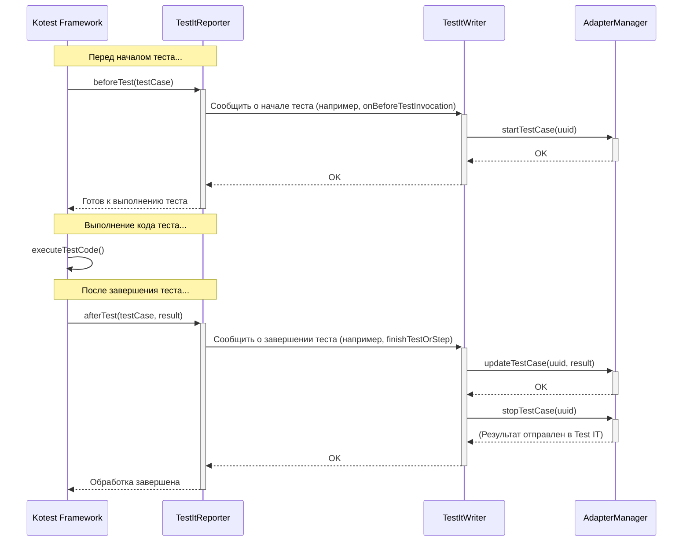

# Chapter 3: Репортер Test IT (TestItReporter)


В [предыдущей главе](02_конфигурация_адаптера_и_клиента__adapterconfig__clientconfiguration__.md) мы разобрались, как настроить наш адаптер, указав ему адрес сервера Test IT и правила его поведения с помощью [Конфигурация Адаптера и Клиента (AdapterConfig, ClientConfiguration)](02_конфигурация_адаптера_и_клиента__adapterconfig__clientconfiguration__.md). Мы подготовили адаптер к работе. Но как он узнает, что тесты *начали* выполняться, *завершились*, и с каким *результатом*?

Представьте, что вы отправляете отчет о спортивном матче. Вы ведь не будете вручную звонить в редакцию после каждого гола или свистка судьи? Это было бы очень утомительно. Нужен специальный корреспондент прямо на стадионе, который будет следить за игрой и автоматически передавать всю информацию. В мире `adapters-kotlin` и фреймворка Kotest таким корреспондентом является **`TestItReporter`**.

## Зачем нужен `TestItReporter`?

Основная задача `TestItReporter` — **слушать** события, которые происходят во время выполнения ваших тестов в Kotest, и сообщать о них [Менеджеру Адаптера (AdapterManager)](01_менеджер_адаптера__adaptermanager__.md) (через посредника, о котором мы поговорим позже). Он действует как "уши" адаптера внутри тестового фреймворка.

Без `TestItReporter` адаптер был бы как глухой репортер — он настроен, готов к работе, но не слышит, что происходит на "поле боя" (во время выполнения тестов). `TestItReporter` автоматически перехватывает такие события, как:

*   Начало выполнения набора тестов (spec).
*   Начало выполнения конкретного теста (test case).
*   Завершение выполнения теста с указанием результата (успех, провал, пропуск).
*   Возникновение ошибок при инициализации тестов.
*   И другие события жизненного цикла тестов.

Он избавляет вас от необходимости вручную вызывать методы `AdapterManager` для каждого теста.

## Как работает `TestItReporter`? Связующее звено

`TestItReporter` — это реализация специальных интерфейсов из Kotest, которые называются `Listener` (слушатель). Kotest спроектирован так, что при наступлении определенных событий (например, перед запуском теста) он автоматически вызывает соответствующие методы у всех зарегистрированных слушателей.

`TestItReporter` реализует несколько таких интерфейсов (`BeforeTestListener`, `AfterTestListener`, `ProjectListener` и т.д.). Когда Kotest, например, собирается запустить тест, он вызывает метод `beforeTest` у `TestItReporter`.

Что делает `TestItReporter` внутри этих методов? Он не выполняет всю работу сам. Он действует как диспетчер, который принимает сигнал от Kotest и передает его дальше, другому компоненту адаптера — [Запись Результатов (TestItWriter)](04_запись_результатов__testitwriter__.md). Именно `TestItWriter` уже знает, как правильно оформить эту информацию и передать ее [Менеджеру Адаптера (AdapterManager)](01_менеджер_адаптера__adaptermanager__.md) для дальнейшей обработки и отправки в Test IT.

**Аналогия:** Представьте цепочку:
1.  **Событие на стадионе (Kotest):** Судья дал свисток к началу матча.
2.  **Репортер на стадионе (`TestItReporter`):** Услышал свисток.
3.  **Репортер сообщает в редакцию (`TestItWriter`):** "Матч начался!" по рации.
4.  **Редакция (`AdapterManager`):** Зафиксировала начало матча и готовит публикацию.

## Как использовать `TestItReporter` в Kotest?

Использовать `TestItReporter` очень просто. Вам нужно зарегистрировать его как "расширение" (extension) в вашем тестовом классе (спецификации Kotest).

Вот минимальный пример:

```kotlin
package org.example.tests

import io.kotest.core.spec.style.FunSpec // Используем стиль FunSpec
import io.kotest.matchers.shouldBe
import ru.testit.listener.TestItReporter // 1. Импортируем репортер

class SimpleTest : FunSpec({
    // 2. Регистрируем TestItReporter как расширение
    extensions(TestItReporter())

    // Обычный тест Kotest
    test("простой тест сложения") {
        val sum = 2 + 2
        sum shouldBe 4 // Проверка утверждения
    }

    test("тест, который упадет") {
        val sum = 2 + 2
        sum shouldBe 5 // Ожидаем неверный результат
    }
})
```

**Объяснение:**

1.  Мы импортируем класс `TestItReporter` из пакета `ru.testit.listener`.
2.  Внутри блока `FunSpec({...})` мы вызываем функцию `extensions()` и передаем ей экземпляр `TestItReporter()`.

**Что произойдет при запуске?**

Когда вы запустите этот тестовый класс, произойдет следующее:

1.  Kotest увидит, что зарегистрирован `TestItReporter`.
2.  **Перед** запуском теста "простой тест сложения", Kotest вызовет метод `beforeTest` у `TestItReporter`. `TestItReporter` (через `TestItWriter`) сообщит `AdapterManager` о начале теста.
3.  Тест "простой тест сложения" выполнится и успешно завершится.
4.  **После** завершения теста, Kotest вызовет метод `afterTest` у `TestItReporter` с результатом "Успех" (PASSED). `TestItReporter` (через `TestItWriter`) сообщит `AdapterManager` об успешном завершении.
5.  Шаги 2-4 повторятся для теста "тест, который упадет", но в шаге 4 результат будет "Провал" (FAILED).
6.  `AdapterManager` (через `TestItWriter` и [API Клиент TMS (TmsApiClient)](09_api_клиент_tms__tmsapiclient__.md)) отправит оба результата в ваш Test IT.

Вам не нужно было писать ни одной строчки кода для *явной* отправки результатов — `TestItReporter` сделал это автоматически, "слушая" Kotest.

*(Примечание: В конструкторе `TestItReporter` есть необязательные параметры, например, для управления шагами (steps), но для базового использования достаточно `TestItReporter()`)*.

## Под капотом: Как `TestItReporter` слушает Kotest?

Давайте немного заглянем внутрь.

**Общая схема взаимодействия:**

Когда Kotest выполняет тест, он проходит через определенные фазы и на каждой фазе "оповещает" зарегистрированных слушателей.



Эта диаграмма упрощенно показывает, как событие в Kotest (`beforeTest`, `afterTest`) передается через `TestItReporter` к `TestItWriter`, а затем к `AdapterManager`, который уже выполняет основную логику адаптера.

**Заглянем в код `TestItReporter`:**

Файл: `testit-adapter-kotest/src/main/kotlin/ru/testit/listener/TestItReporter.kt`

```kotlin
package ru.testit.listener

// Импорты интерфейсов Listener из Kotest
import io.kotest.core.listeners.*
import io.kotest.core.spec.Spec
import io.kotest.core.test.TestCase
import io.kotest.core.test.TestResult
import kotlin.reflect.KClass

// Объявление класса TestItReporter, реализующего интерфейсы Kotest
class TestItReporter(
    // Конструктор может принимать параметры, например, для управления шагами
) : BeforeTestListener, // Слушатель события "Перед тестом"
    AfterTestListener,  // Слушатель события "После теста"
    // ... другие интерфейсы слушателей (BeforeSpec, AfterSpec и т.д.) ...
    ProjectListener {

    // Создаем экземпляр TestItWriter, которому будем делегировать работу
    val writer = TestItWriter()

    // Пример реализации метода интерфейса BeforeTestListener
    override suspend fun beforeTest(testCase: TestCase) {
        // Просто передаем управление в TestItWriter
        writer.registerBeforeAfterExtensions(testCase)
        // Внутри writer будет логика для подготовки к запуску теста
    }

    // Пример реализации метода интерфейса AfterTestListener
    override suspend fun afterTest(testCase: TestCase, result: TestResult) {
        // Обрабатываем возможные ошибки в блоках до/после теста
        val isTestFinished = writer.handleFixturesFails(testCase, result)
        if (isTestFinished) {
            return // Если ошибка была в fixture, тест уже обработан
        }
        // Передаем управление в TestItWriter для завершения теста
        writer.finishTestOrStep(testCase, result)
        // Внутри writer будет логика для обновления статуса и отправки
    }

    // ... Реализации других методов слушателей (beforeSpec, afterSpec, etc.) ...
    // Они также в основном вызывают соответствующие методы writer.
}
```

**Объяснение кода:**

1.  Класс `TestItReporter` объявлен с реализацией нескольких интерфейсов `...Listener` из Kotest (например, `BeforeTestListener`, `AfterTestListener`). Это "обязывает" его реализовать методы, которые Kotest будет вызывать (`beforeTest`, `afterTest` и другие).
2.  Внутри `TestItReporter` создается экземпляр `TestItWriter()`. Это показывает, что `TestItReporter` сам не занимается сложной логикой обработки результатов, а **делегирует** ее `TestItWriter`.
3.  Реализации методов (`beforeTest`, `afterTest`) очень простые: они принимают информацию от Kotest (например, `testCase` и `result`) и тут же передают ее соответствующему методу `writer`.

Таким образом, `TestItReporter` — это тонкий слой-адаптер между специфическими для Kotest механизмами слушателей и общей логикой адаптера, реализованной в `TestItWriter` и `AdapterManager`.

## Ключевые зависимости `TestItReporter`

*   **Kotest Framework:** Предоставляет интерфейсы `Listener` и вызывает методы `TestItReporter` во время жизненного цикла тестов.
*   **[Запись Результатов (TestItWriter)](04_запись_результатов__testitwriter__.md):** Компонент, которому `TestItReporter` делегирует фактическую обработку событий начала/завершения тестов и их результатов.

## Заключение

Мы узнали о `TestItReporter` — важнейшем компоненте для интеграции `adapters-kotlin` с фреймворком Kotest. Он работает как автоматический слушатель событий, который "слышит" все, что происходит с тестами во время выполнения (старт, стоп, результат), и сообщает об этом остальным частям адаптера. Благодаря `TestItReporter`, вам не нужно вручную управлять запуском и остановкой тестов с точки зрения Test IT — достаточно просто зарегистрировать его как расширение в вашем тестовом классе.

В следующей главе мы подробнее рассмотрим компонент, которому `TestItReporter` передает всю собранную информацию — `TestItWriter`. Мы узнаем, как он обрабатывает эти события и подготавливает данные для отправки.

**Далее:** [Глава 4: Запись Результатов (TestItWriter)](04_запись_результатов__testitwriter__.md)

---

Generated by [AI Codebase Knowledge Builder](https://github.com/The-Pocket/Tutorial-Codebase-Knowledge)