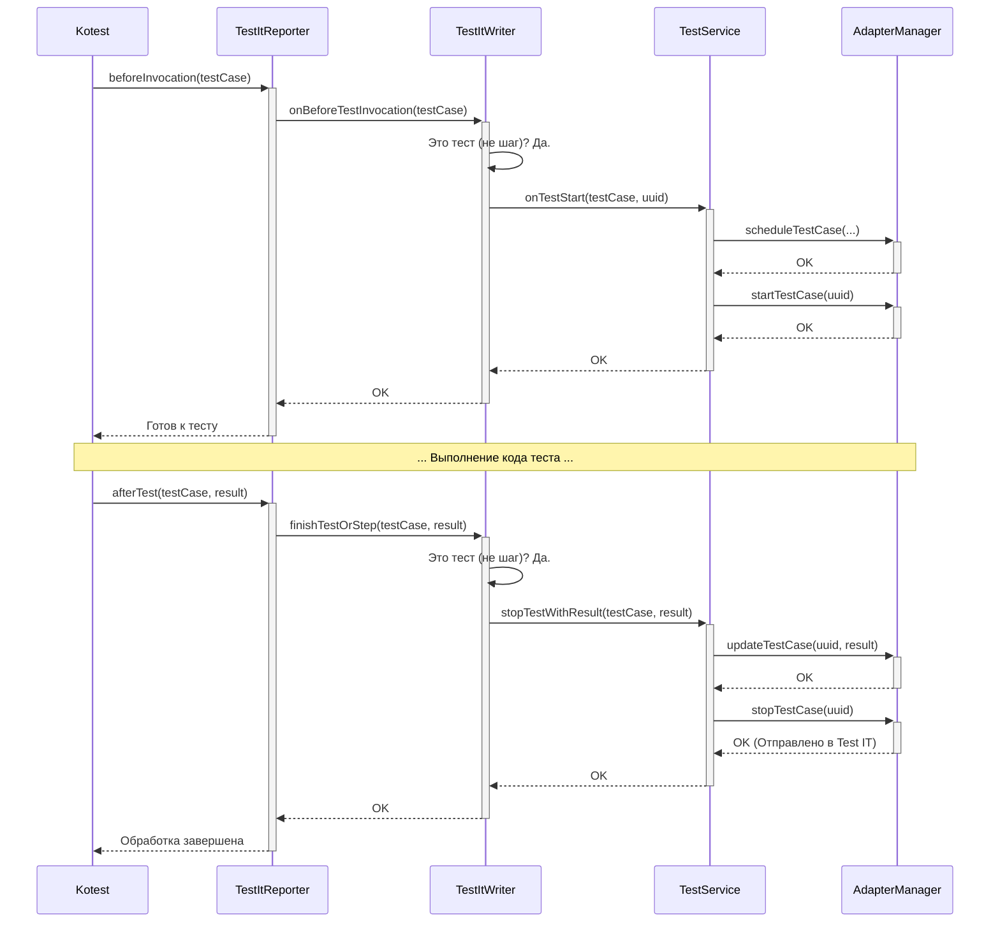

# Chapter 4: Запись Результатов (TestItWriter)


В [предыдущей главе](03_репортер_test_it__testitreporter__.md) мы познакомились с [Репортером Test IT (TestItReporter)](03_репортер_test_it__testitreporter__.md), нашим "корреспондентом", который слушает события во время выполнения тестов Kotest. Он узнает, когда тест начинается или заканчивается. Но сам `TestItReporter` не занимается сложной обработкой этих событий. Он просто передает информацию дальше. Кому? Именно **`TestItWriter`**!

Представьте большую съемочную площадку (ваш тестовый проект). `TestItReporter` — это оператор с микрофоном, который бегает по площадке и кричит в рацию: "Начали снимать сцену 'Логин'!", "Актер споткнулся (ошибка)!", "Сцена 'Логин' отснята!". Но его сообщения принимает не главный продюсер ([AdapterManager](01_менеджер_адаптера__adaptermanager__.md)), а **ассистент режиссера (`TestItWriter`)**. Этот ассистент уже понимает, что крикнул оператор, и дает конкретные команды нужным специалистам: "Оператор камеры 1 ([TestService](05_сервис_тестов__testservice__.md)), начни запись!", "Звукорежиссер ([StepService](05_сервис_тестов__testservice__.md)), запиши этот шаг!", "Реквизитор ([FixtureService](05_сервис_тестов__testservice__.md)), подготовь сцену (before hook)!".

## Зачем нужен `TestItWriter`? Проблема перевода

`TestItReporter` получает события в терминах Kotest (`beforeTest`, `afterTest`, `beforeSpec`, `afterSpec` и т.д.). Но [AdapterManager](01_менеджер_адаптера__adaptermanager__.md) и его помощники ([TestService](05_сервис_тестов__testservice__.md), [StepService](05_сервис_тестов__testservice__.md) и др.) оперируют более общими понятиями: "начать тест", "завершить шаг", "записать результат фикстуры".

`TestItWriter` решает эту проблему **перевода и маршрутизации**. Он:

1.  **Получает сигналы** от `TestItReporter`.
2.  **Анализирует** контекст сигнала: это начало теста? Завершение шага? Ошибка в настройке?
3.  **Вызывает правильного "специалиста"** (сервис: `TestService`, `StepService` или `FixtureService`), передавая ему уже понятную команду и нужные данные.

Без `TestItWriter` наш `TestItReporter` кричал бы в пустоту, или же ему самому пришлось бы разбираться во всей внутренней кухне адаптера, что сделало бы его слишком сложным и привязанным к деталям реализации. `TestItWriter` действует как **диспетчер или переводчик** между миром Kotest и миром адаптера Test IT.

## Как работает `TestItWriter`?

`TestItWriter` не является классом, который вы напрямую используете в своих тестах. Он создается внутри `TestItReporter`, как мы видели в [прошлой главе](03_репортер_test_it__testitreporter__.md).

```kotlin
// Внутри TestItReporter.kt
class TestItReporter(/*...*/) : /*...Listeners...*/ {

    // TestItWriter создается здесь!
    val writer = TestItWriter()

    override suspend fun beforeTest(testCase: TestCase) {
        // Reporter просто вызывает метод Writer'а
        writer.registerBeforeAfterExtensions(testCase)
        // ...
    }

    override suspend fun afterTest(testCase: TestCase, result: TestResult) {
        // Reporter снова делегирует работу Writer'у
        writer.finishTestOrStep(testCase, result)
        // ...
    }

    // ... и так для других методов ...
}
```

Как видите, `TestItReporter` почти ничего не делает сам, а только передает вызовы в `TestItWriter`. А что делает `TestItWriter`? Он вызывает нужные сервисы.

### Основные обязанности (Маршрутизация событий)

`TestItWriter` "слушает" `TestItReporter` и реагирует на ключевые события Kotest, вызывая соответствующие сервисы:

*   **Перед всеми тестами в классе (`beforeSpec`):** `TestItWriter.onBeforeAll` -> Запускает контейнеры для группировки тестов ([AdapterManager](01_менеджер_адаптера__adaptermanager__.md)'s `startMainContainer`, `startClassContainer`).
*   **После всех тестов в классе (`afterSpec`):** `TestItWriter.onAfterAll` -> Завершает контейнеры ([AdapterManager](01_менеджер_адаптера__adaptermanager__.md)'s `stopClassContainer`, `stopMainContainer`).
*   **Перед каждым тестом (`beforeTest`, `beforeInvocation`):**
    *   `TestItWriter.registerBeforeAfterExtensions` -> Регистрирует возможные `beforeTest` и `afterTest` блоки как "фикстуры" с помощью `FixtureService`.
    *   `TestItWriter.finishBeforeTestIfExists` -> Завершает фикстуру `beforeTest`, если она была.
    *   `TestItWriter.onBeforeTestInvocation` -> Анализирует, это реальный тест (`TestType.Test`) или шаг (`@Step` аннотация)?
        *   Если тест: вызывает `TestService.onTestStart` для начала записи теста.
        *   Если шаг: вызывает `StepService.onStepStart` для начала записи шага.
*   **После каждого теста (`afterTest`, `afterInvocation`):**
    *   `TestItWriter.onAfterTestInvocation` -> Обновляет время старта для фикстуры `afterTest`.
    *   `TestItWriter.handleFixturesFails` -> Проверяет, не было ли ошибки в `beforeTest` или `afterTest` фикстурах, и обрабатывает их через `FixtureService`.
    *   `TestItWriter.finishTestOrStep` -> Анализирует, это тест или шаг?
        *   Если тест: вызывает `TestService.stopTestWithResult` для завершения теста с результатом Kotest.
        *   Если шаг: вызывает `StepService.stopStepWithResult` для завершения шага с результатом Kotest.

*   **При ошибке инициализации (`instantiationError`):** `TestItWriter.onInstantiationError` -> Создает и сразу завершает специальный "проваленный" тест через `TestService`.

**Аналогия:** Ассистент режиссера (`TestItWriter`) получает команду "Сцена 'Погоня' началась!". Он смотрит в сценарий: это основной сюжетный момент (тест) или просто короткая вставка (шаг)? Если сюжетный момент, он кричит оператору основной камеры ([TestService](05_сервис_тестов__testservice__.md)): "Начинай запись!". Если вставка, то оператору дрона ([StepService](05_сервис_тестов__testservice__.md)): "Снимай этот кадр!".

### Пример: Как обрабатывается начало теста

Давайте посмотрим, что происходит, когда Kotest запускает обычный тест:

1.  Kotest вызывает `TestItReporter.beforeInvocation(testCase)`.
2.  `TestItReporter` немедленно вызывает `TestItWriter.onBeforeTestInvocation(testCase)`.
3.  `TestItWriter` смотрит на `testCase`: это не шаг (нет аннотации `@Step`) и тип `TestType.Test`. Значит, это обычный тест.
4.  `TestItWriter` вызывает `testService.onTestStart(testCase, uuid)`.

```kotlin
// Внутри TestItWriter.kt

// Экземпляры сервисов создаются здесь
private val testService = TestService(/*...*/)
private val stepService = StepService(/*...*/)
private val fixtureService = FixtureService(/*...*/)
// ... и другие ...

// Вызывается из TestItReporter.beforeInvocation
fun onBeforeTestInvocation(testCase: TestCase) {
    if (!isTestOrContainersEnabled(testCase)) {
        // Игнорируем, если это не тест и не контейнер
        return
    }

    // Проверяем, помечен ли тест как шаг (например, аннотацией @Step)
    var isStep = testCase.isStep();
    if (isStep) {
        // Если это шаг, вызываем сервис шагов
        return stepService.onStepStart(testCase)
    }

    // Если это не шаг, значит, это обычный тест
    // Вызываем сервис тестов
    onTestStart(testCase)
}

// Вспомогательный метод для старта теста
private fun onTestStart(testCase: TestCase) {
    // ... (получаем UUID для теста) ...
    val uuid = executableTestService.getUuid()

    // Вызываем TestService для реального старта теста
    testService.onTestStart(testCase, uuid)

    // ... (обновляем контейнер, чтобы он "знал" об этом тесте) ...
}
```

В этом коде `TestItWriter` выполняет роль **маршрутизатора**: он анализирует `testCase` и решает, какой сервис (`stepService` или `testService`) вызвать. Саму логику начала теста выполняет уже `TestService`.

## Под капотом: Поток событий

Давайте визуализируем поток управления, когда начинается и заканчивается обычный тест:



Диаграмма показывает, как `TestItWriter` принимает событие от `TestItReporter`, определяет, что это тест, и передает управление `TestService`. `TestService`, в свою очередь, использует [AdapterManager](01_менеджер_адаптера__adaptermanager__.md) для фактического управления жизненным циклом теста и его отправки.

### Взгляд в код `TestItWriter.kt`

Файл: `testit-adapter-kotest/src/main/kotlin/ru/testit/listener/TestItWriter.kt`

```kotlin
package ru.testit.listener

// ... (импорты) ...
import ru.testit.services.* // Импортируем сервисы!

class TestItWriter () {
    // ... (логгер и другие поля) ...

    // Получаем AdapterManager (главный координатор)
    private val adapterManager = Adapter.getAdapterManager();

    // Поля для хранения текущего контекста (UUIDs тестов/шагов)
    private val uuids = ConcurrentHashMap<TestPath, String>()
    // ... (другие контекстные данные) ...

    // --- Создание экземпляров сервисов ---
    // Сервис для управления основной информацией о тесте/шаге
    private val executableTestService = ExecutableTestService(/*...*/)
    // Сервис для обработки шагов (@Step)
    private val stepService = StepService(
        adapterManager = adapterManager,
        uuids = uuids,
        executableTestService = executableTestService
    )
    // Сервис для обработки тестов (TestType.Test)
    private val testService = TestService(
        adapterManager = adapterManager,
        uuids = uuids,
        executableTestService = executableTestService
    )
    // Сервис для обработки фикстур (before/after)
    private val fixtureService = FixtureService(
        adapterManager = adapterManager,
        executableTestService = executableTestService,
        testService = testService
    )
    // --- Конец создания сервисов ---

    // Метод, вызываемый ПЕРЕД тестом/шагом execution
    fun onBeforeTestInvocation(testCase: TestCase) {
        // ... (проверка, что это тест или контейнер) ...

        var isStep = testCase.isStep(); // Проверяем, шаг ли это
        if (isStep) {
            // ДА, это шаг -> вызываем StepService
            return stepService.onStepStart(testCase)
        }
        // НЕТ, это не шаг -> вызываем (косвенно) TestService
        onTestStart(testCase)
    }

    // Метод, вызываемый ПОСЛЕ теста/шага execution
    suspend fun finishTestOrStep(testCase: TestCase, result: TestResult): Unit {
        // ... (проверка, что это тест или контейнер) ...

        var isStep = testCase.isStep(); // Проверяем, шаг ли это
        if (isStep) {
            // ДА, это шаг -> вызываем StepService
            return stepService.stopStepWithResult(testCase, result)
        }
        // НЕТ, это не шаг -> вызываем TestService
        testService.stopTestWithResult(testCase, result)
    }

    // ... (другие методы: onBeforeAll, onAfterAll, handleFixturesFails и т.д.)
    // Они также вызывают соответствующие методы сервисов.
}
```

Ключевые моменты в коде:

1.  `TestItWriter` **создает экземпляры** всех необходимых сервисов (`TestService`, `StepService`, `FixtureService`).
2.  Он передает этим сервисам ссылку на [AdapterManager](01_менеджер_адаптера__adaptermanager__.md) и общие структуры данных (`uuids`).
3.  Методы `TestItWriter` (как `onBeforeTestInvocation`, `finishTestOrStep`) содержат **логику маршрутизации**: они определяют тип события или сущности (тест, шаг, фикстура) и вызывают соответствующий метод нужного сервиса.

## Ключевые зависимости `TestItWriter`

*   **[Репортер Test IT (TestItReporter)](03_репортер_test_it__testitreporter__.md):** Получает от него необработанные события Kotest.
*   **[Сервис Тестов (TestService)](05_сервис_тестов__testservice__.md):** Вызывает его для обработки жизненного цикла тестов.
*   **`StepService`:** Вызывает его для обработки жизненного цикла шагов.
*   **`FixtureService`:** Вызывает его для обработки фикстур (before/after).
*   **[Менеджер Адаптера (AdapterManager)](01_менеджер_адаптера__adaptermanager__.md):** Не напрямую, а через сервисы. `TestItWriter` передает ссылку на `AdapterManager` в конструкторы сервисов.

## Заключение

Мы разобрались с ролью `TestItWriter` — это важный **посредник и маршрутизатор** в архитектуре адаптера. Он принимает "сырые" сигналы о событиях жизненного цикла тестов от [TestItReporter](03_репортер_test_it__testitreporter__.md), анализирует их и передает команды конкретным "исполнителям" — сервисам (`TestService`, `StepService`, `FixtureService`). Эти сервисы уже выполняют основную работу по взаимодействию с [AdapterManager](01_менеджер_адаптера__adaptermanager__.md) для управления результатами тестов и их отправки в Test IT.

Теперь, когда мы знаем, как `TestItWriter` направляет команды, самое время познакомиться с одним из основных исполнителей — `TestService`. Он отвечает за управление информацией о самих тестах.

**Далее:** [Глава 5: Сервис Тестов (TestService)](05_сервис_тестов__testservice__.md)

---

Generated by [AI Codebase Knowledge Builder](https://github.com/The-Pocket/Tutorial-Codebase-Knowledge)