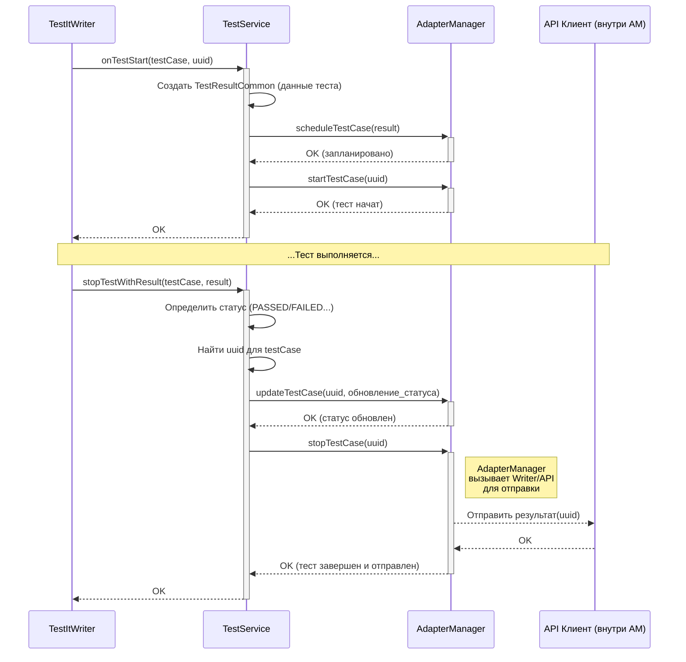

# Chapter 5: Сервис Тестов (TestService)


В [прошлой главе](04_запись_результатов__testitwriter__.md) мы познакомились с [Записью Результатов (TestItWriter)](04_запись_результатов__testitwriter__.md), нашим "ассистентом режиссера", который получает сигналы от репортера и передает команды дальше. Он решает, *кто* должен выполнить работу: сервис для тестов, сервис для шагов или сервис для настроек (фикстур).

Теперь пришло время познакомиться с одним из ключевых исполнителей — **Сервисом Тестов (`TestService`)**. Это специалист, отвечающий за самую важную часть "съемочного процесса" — запись основной "сцены", то есть самого тела вашего теста.

## Зачем нужен `TestService`? Специалист по основной работе

Представьте снова нашу съемочную площадку. [TestItWriter](04_запись_результатов__testitwriter__.md) — ассистент режиссера, получает команду "Начинаем снимать сцену 'Проверка логина'!". Он знает, что это *основная* сцена, а не подготовительный кадр или короткий шаг. Поэтому он обращается к **главному оператору (`TestService`)**, который отвечает именно за съемку таких ключевых сцен.

`TestService` **не занимается** шагами внутри теста (для этого есть `StepService`) или подготовкой/очисткой перед/после теста (этим занимается `FixtureService`). Его зона ответственности — **только основное тело теста**:

1.  **Зарегистрировать начало:** Когда [TestItWriter](04_запись_результатов__testitwriter__.md) говорит "Начинаем!", `TestService` сообщает [Менеджеру Адаптера (AdapterManager)](01_менеджер_адаптера__adaptermanager__.md), что тест стартовал.
2.  **Зафиксировать результат:** Когда тест завершается (успешно, с ошибкой или был пропущен), [TestItWriter](04_запись_результатов__testitwriter__.md) сообщает об этом `TestService`. `TestService`, в свою очередь, передает финальный статус и возможные ошибки [AdapterManager](01_менеджер_адаптера__adaptermanager__.md).
3.  **Связать информацию:** Он также помогает правильно оформить всю информацию о тесте (имя, класс, уникальный ID), чтобы [AdapterManager](01_менеджер_адаптера__adaptermanager__.md) мог корректно сохранить и отправить ее.

Без `TestService` наш `TestItWriter` должен был бы сам выполнять всю эту работу по обработке именно тестовых событий, что сделало бы его слишком громоздким. `TestService` — это выделенный "рабочий", специализирующийся на обработке основной логики тестов.

## Как используется `TestService`? (Роль в цепочке вызовов)

Вы, как пользователь, **никогда не вызываете `TestService` напрямую**. Его вызывает [TestItWriter](04_запись_результатов__testitwriter__.md). Давайте вспомним код из `TestItWriter` (из [Главы 4](04_запись_результатов__testitwriter__.md)), где это происходит:

**Пример вызова `TestService` из `TestItWriter`:**

```kotlin
// Внутри TestItWriter.kt

// TestService создается внутри TestItWriter
private val testService = TestService(
    adapterManager = adapterManager, /*...*/
)

// Метод, вызываемый ПЕРЕД выполнением теста (упрощенно)
fun onBeforeTestInvocation(testCase: TestCase) {
    // ... (проверки) ...

    var isStep = testCase.isStep(); // Это шаг?
    if (isStep) {
        // stepService.onStepStart(testCase) // Вызвать сервис шагов
    } else {
        // НЕТ, это тест -> вызвать (косвенно) TestService
        onTestStart(testCase)
    }
}

// Вспомогательный метод, который вызывает TestService
private fun onTestStart(testCase: TestCase) {
    // ... (получаем UUID) ...
    val uuid = executableTestService.getUuid()

    // !!! Вот он, вызов TestService !!!
    testService.onTestStart(testCase, uuid)

    // ... (обновление контейнера) ...
}

// Метод, вызываемый ПОСЛЕ выполнения теста (упрощенно)
suspend fun finishTestOrStep(testCase: TestCase, result: TestResult): Unit {
     // ... (проверки) ...

    var isStep = testCase.isStep(); // Это шаг?
    if (isStep) {
       // stepService.stopStepWithResult(...) // Вызвать сервис шагов
    } else {
        // НЕТ, это тест -> вызвать TestService
        // !!! Вот он, вызов TestService !!!
        testService.stopTestWithResult(testCase, result)
    }
}
```

Этот код показывает, что `TestItWriter` определяет, является ли событие началом или концом основного теста (а не шага), и если да, то вызывает соответствующий метод у `testService`.

## Под капотом: Как `TestService` работает с `AdapterManager`

Когда `TestItWriter` вызывает методы `TestService`, последний не делает всю работу сам. Он, в свою очередь, дает команды главному диспетчеру — [Менеджеру Адаптера (AdapterManager)](01_менеджер_адаптера__adaptermanager__.md).

**Поток событий для старта теста:**

1.  `TestItWriter` вызывает `testService.onTestStart(testCase, uuid)`.
2.  `TestService` создает объект `TestResultCommon` (подробнее о нем в [Главе 7](07_модель_результата_теста__testresultcommon__.md)), заполняя его информацией из `testCase` (имя, класс и т.д.) и присваивая ему `uuid`.
3.  `TestService` вызывает `adapterManager.scheduleTestCase(result)`, чтобы "запланировать" тест к запуску в адаптере.
4.  `TestService` вызывает `adapterManager.startTestCase(uuid)`, чтобы фактически пометить тест как начавшийся.

**Поток событий для завершения теста:**

1.  `TestItWriter` вызывает `testService.stopTestWithResult(testCase, result)`.
2.  `TestService` определяет финальный статус теста (`PASSED`, `FAILED`, `SKIPPED`) на основе `result` из Kotest.
3.  `TestService` извлекает `uuid` для данного `testCase` (он был сохранен при старте).
4.  `TestService` вызывает `adapterManager.updateTestCase(uuid, ...)`, передавая ему функцию для обновления статуса и возможной ошибки.
5.  `TestService` вызывает `adapterManager.stopTestCase(uuid)`, чтобы пометить тест как завершенный и инициировать отправку результата в Test IT.

**Диаграмма последовательности:**



Эта диаграмма показывает, что `TestService` является посредником между высокоуровневыми событиями от `TestItWriter` и низкоуровневыми командами для `AdapterManager`.

**Заглянем в код `TestService`:**

Файл: `testit-adapter-kotest/src/main/kotlin/ru/testit/services/TestService.kt`

```kotlin
package ru.testit.services

// ... (импорты) ...
import ru.testit.models.ItemStatus // Статусы теста
import ru.testit.models.TestResultCommon // Модель результата

// Конструктор TestService
class TestService (
    // Зависимость: главный менеджер адаптера
    private val adapterManager: AdapterManager,
    // Зависимость: хранилище UUID для тестов
    @VisibleForTesting
    internal val uuids: ConcurrentHashMap<TestPath, String>,
    // Зависимость: сервис для управления текущим выполняемым тестом/шагом
    private val executableTestService: ExecutableTestService
) {
    // ... (логгер и форматтер имени) ...

    // Метод, вызываемый при старте теста
    fun onTestStart(testCase: TestCase, uuid: String) {
        // ... (получение полного имени, имени класса, пакета) ...
        var fullName = formatter.formatTestPath(testCase, " / ") // Полное имя для externalId
        var spaceName : String = testCase.spec.javaClass.packageName // Имя пакета
        var className: String = testCase.spec.javaClass.simpleName // Имя класса

        // Создаем объект с информацией о тесте
        val result = TestResultCommon(
            uuid = uuid,
            className = className,
            name = testCase.name.testName, // Имя самого теста
            spaceName = spaceName,
            externalId = Utils.genExternalID(fullName), // Уникальный ID для связи с Test IT
            labels = Utils.defaultLabels(), // Метки
            linkItems = Utils.defaultLinks() // Ссылки
        )

        // Сохраняем UUID для этого теста
        uuids[testCase.descriptor.path()] = uuid

        // Передаем команды Менеджеру Адаптера
        adapterManager.scheduleTestCase(result) // 1. Запланировать
        adapterManager.startTestCase(uuid)      // 2. Начать
    }

    // Метод, вызываемый при завершении теста
    fun stopTestWithResult(testCase: TestCase, result: TestResult) {
        // ... (логика обработки контейнеров шагов опущена) ...

        // Получаем UUID теста, который мы сохранили при старте
        var path = testCase.descriptor.path()
        val uuid = uuids[path] ?: "Unknown test ${testCase.descriptor}"

        // ... (обновление контекста теста, если нужно) ...

        // Определяем финальный статус и вызываем соответствующий обработчик
        if (result is TestResult.Success)
             onTestSuccessful(testCase) // Вызвать обработчик успеха
        else if (result is TestResult.Ignored)
             onTestIgnored(testCase, result.errorOrNull) // Вызвать обработчик пропуска
        else if (result is TestResult.Failure || result is TestResult.Error)
             onTestFailed(testCase, result.errorOrNull!!) // Вызвать обработчик провала
    }

    // Вспомогательный метод для успешного завершения
    private fun onTestSuccessful(testCase: TestCase) {
        // ... (логирование) ...
        // Вызываем общий метод остановки с нужным статусом
        stopTestCase(executableTestService.getUuid(), null, ItemStatus.PASSED)
    }

    // Вспомогательный метод для пропущенного теста
    private fun onTestIgnored(testCase: TestCase, cause: Throwable?) {
        // ... (логирование) ...
        // Вызываем общий метод остановки с нужным статусом
        stopTestCase(executableTestService.getUuid(), cause, ItemStatus.SKIPPED);
    }

    // Вспомогательный метод для проваленного теста
    private fun onTestFailed(testCase: TestCase, cause: Throwable) {
        // ... (логирование и проверки) ...
        // Вызываем общий метод остановки с нужным статусом
        stopTestCase(executableTestService.getUuid(), cause, ItemStatus.FAILED);
    }

    // Общий метод для остановки теста и отправки результата
    fun stopTestCase(uuid: String, throwable: Throwable?, status: ItemStatus) {
        // Обновляем результат: устанавливаем статус и ошибку (если есть)
        adapterManager.updateTestCase(uuid, Consumers.setStatus(status, throwable))
        // Сообщаем менеджеру, что тест завершен (он инициирует отправку)
        adapterManager.stopTestCase(uuid)
    }
}
```

**Ключевые моменты кода:**

1.  **Зависимости:** `TestService` получает `AdapterManager` (для выполнения команд), `uuids` (чтобы помнить ID текущих тестов) и `ExecutableTestService` (вспомогательный сервис для отслеживания статуса шагов и фикстур, влияющих на тест).
2.  **`onTestStart`:** Создает все необходимые данные для регистрации теста (`TestResultCommon`) и вызывает `scheduleTestCase`/`startTestCase` у `AdapterManager`.
3.  **`stopTestWithResult`:** Анализирует результат `TestResult` от Kotest, определяет финальный статус (`PASSED`, `FAILED`, `SKIPPED`) и вызывает вспомогательные методы (`onTestSuccessful` и т.д.).
4.  **Вспомогательные методы (`onTest...`)**: Вызывают общий метод `stopTestCase`.
5.  **`stopTestCase`:** Финальный шаг — вызывает `updateTestCase` (чтобы обновить статус/ошибку) и `stopTestCase` (чтобы завершить и отправить) у `AdapterManager`.

## Ключевые зависимости `TestService`

*   **[Менеджер Адаптера (AdapterManager)](01_менеджер_адаптера__adaptermanager__.md):** Основной компонент, которому `TestService` делегирует выполнение команд по управлению жизненным циклом теста.
*   **[Запись Результатов (TestItWriter)](04_запись_результатов__testitwriter__.md):** Компонент, который вызывает методы `TestService` в ответ на события от `TestItReporter`.
*   **`uuids` (Map):** Общая структура данных (обычно из `TestItWriter`) для хранения соответствия между `TestCase` из Kotest и уникальным `uuid`, который используется в адаптере.
*   **`ExecutableTestService`:** Внутренний сервис, который помогает `TestService` учитывать состояние шагов или фикстур при определении финального статуса теста (например, если шаг упал, тест тоже должен упасть).

## Заключение

Мы рассмотрели `TestService` — специализированный компонент адаптера, ответственный за обработку событий, связанных **исключительно с основным телом теста**. Он получает команды от [TestItWriter](04_запись_результатов__testitwriter__.md) и использует [AdapterManager](01_менеджер_адаптера__adaptermanager__.md) для регистрации начала теста, обновления его статуса (успех, провал, пропуск) и инициирования отправки результатов в Test IT. Он не занимается шагами или подготовкой/очисткой — для этого есть другие сервисы.

Теперь мы знаем, как адаптер управляет запуском и завершением теста. Но что если нам нужно прикрепить к тесту дополнительную информацию, например, скриншот или какие-то вычисленные данные? Для этого существует `TestItContext`.

**Далее:** [Глава 6: Контекст Теста (TestItContext)](06_контекст_теста__testitcontext__.md)

---

Generated by [AI Codebase Knowledge Builder](https://github.com/The-Pocket/Tutorial-Codebase-Knowledge)