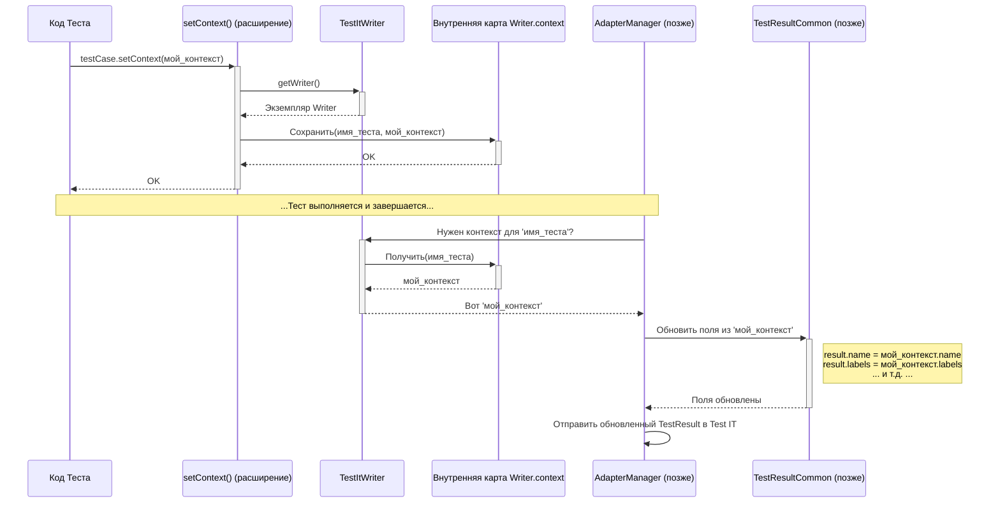

# Chapter 6: Контекст Теста (TestItContext)


В [предыдущей главе](05_сервис_тестов__testservice__.md) мы разобрались, как [Сервис Тестов (TestService)](05_сервис_тестов__testservice__.md) обрабатывает основной жизненный цикл теста: его начало, завершение и статус (успех/провал/пропуск). Он сообщает [Менеджеру Адаптера (AdapterManager)](01_менеджер_адаптера.md) о том, что происходит с "основной сценой".

Но что, если стандартной информации (имя теста, класс, статус) недостаточно? Что, если вы хотите прямо во время выполнения добавить к тесту:

*   Более **понятное название** (особенно для параметризованных тестов)?
*   Связь с **ручным тест-кейсом** в Test IT (Work Item ID)?
*   Произвольные **метки** (Labels)?
*   **Описание** или **ссылки**, специфичные для этого запуска?

Представьте, что вы отправляете отчет о тесте в Test IT. Автоматически сгенерированное имя вроде `testMethod[1]` или `PythagTriple(7, 7, 7)` может быть не очень информативным. Хотелось бы иметь возможность прикрепить к этому отчету дополнительные "стикеры" с пояснениями. Вот для этого и нужен **Контекст Теста (`TestItContext`)**.

## Что такое `TestItContext`? Набор "стикеров" для теста

`TestItContext` — это простая структура данных (data class в Kotlin), которая служит **контейнером для дополнительной информации** о вашем тесте. Вы можете думать о ней как о наборе стикеров, которые вы можете "наклеить" на карточку вашего теста ([`TestResultCommon`](07_модель_результата_теста__testresultcommon__.md)) во время его выполнения, чтобы добавить детали, не предусмотренные стандартными полями.

Вот как выглядит этот контейнер (упрощенно, полный список полей см. в исходном коде):

```kotlin
// Файл: testit-adapter-kotest/src/main/kotlin/ru/testit/models/TestItContext.kt
package ru.testit.models

data class TestItContext (
    var uuid: String? = null, // Внутренний ID теста (обычно не задается вручную)
    var externalId: String? = null, // ID для связи с тест-кейсом в Test IT
    var links: MutableList<LinkItem>? = null, // Список ссылок
    var workItemIds: MutableList<String>? = null, // Список ID связанных ручных тестов
    var attachments: MutableList<String>? = null, // Список путей к вложениям
    var name: String? = null, // Пользовательское имя теста для Test IT
    var title: String? = null, // Заголовок теста в карточке Test IT
    var message: String? = null, // Дополнительное сообщение
    var itemStatus: ItemStatus? = null, // Позволяет переопределить статус (редко используется)
    var description: String? = null, // Описание теста в карточке Test IT
    var parameters: MutableMap<String, String>? = null, // Параметры теста
    var labels: MutableList<Label>? = null, // Список меток
)
```

Как видите, `TestItContext` содержит поля для всех тех дополнительных данных, которые мы хотели прикрепить: `name` (имя), `description` (описание), `workItemIds` (ID ручных тестов), `links` (ссылки), `labels` (метки) и другие.

## Как использовать `TestItContext`?

Использовать контекст очень просто, особенно в связке с Kotest. Адаптер предоставляет удобную функцию-расширение `setContext()` для объекта `TestCase` (который доступен внутри ваших тестов Kotest).

**Пример: Добавление имени и метки к параметризованному тесту**

Давайте возьмем пример параметризованного теста из README, который проверяет теорему Пифагора:

```kotlin
// Упрощенный пример из README.md
package org.example.tests

import io.kotest.core.spec.style.FunSpec
import io.kotest.datatest.withData
import io.kotest.matchers.shouldBe
import ru.testit.listener.TestItReporter
import ru.testit.models.Label // Импортируем Label
import ru.testit.models.TestItContext // Импортируем TestItContext
import ru.testit.utils.setContext // Импортируем функцию setContext

// Структура данных для параметров
data class PythagTriple(val a: Int, val b: Int, val c: Int)
// Функция для проверки
fun isPythagTriple(a: Int, b: Int, c: Int): Boolean = a * a + b * b == c * c

class NestingTest : FunSpec({
   // Регистрируем репортер
   extensions(TestItReporter(true))

   context("Проверка троек Пифагора") {
       withData(
           PythagTriple(3, 4, 5),
           PythagTriple(6, 8, 10),
           PythagTriple(8, 15, 17),
           PythagTriple(7, 24, 25),
           PythagTriple(7, 7, 7) // Неверная тройка
       ) { (a, b, c) -> // Для каждой тройки данных...

           // 1. Создаем объект TestItContext
           val context = TestItContext(
               // Задаем понятное имя теста, включающее параметры
               name = "Проверка тройки ($a, $b, $c)",
               // Добавляем метку
               labels = mutableListOf(Label("Пифагор")),
               // Можно добавить и ID ручного теста, если он есть
               // workItemIds = mutableListOf("MANUAL-123")
           )

           // 2. "Прикрепляем" контекст к текущему тесту
           testCase.setContext(context)

           // 3. Выполняем сам тест
           isPythagTriple(a, b, c) shouldBe true
           // Для тройки (7, 7, 7) этот тест упадет
       }
   }
})
```

**Объяснение:**

1.  **Импорты:** Мы импортируем `TestItContext`, `Label` и функцию `setContext`.
2.  **Внутри теста:** Для каждого набора данных `(a, b, c)` мы создаем новый экземпляр `TestItContext`.
3.  **Заполнение полей:** Мы задаем полю `name` динамическое имя, зависящее от текущих параметров `a`, `b`, `c`. Мы также добавляем метку "Пифагор" в список `labels`.
4.  **Применение контекста:** Мы вызываем `testCase.setContext(context)`. `testCase` — это специальный объект Kotest, представляющий текущий выполняемый тест. Функция `setContext` (предоставляемая адаптером) берет наш объект `context` и сохраняет его для этого теста.
5.  **Выполнение теста:** Дальше идет обычная логика теста.

**Что произойдет в Test IT?**

Когда результаты этого теста будут загружены в Test IT:

*   Вместо стандартного имени вроде `PythagTriple(a=7, b=7, c=7)` тест будет отображаться с именем **"Проверка тройки (7, 7, 7)"**.
*   К этому тесту будет прикреплена метка **"Пифагор"**.
*   (Если бы мы указали `workItemIds`, этот автотест был бы связан с соответствующим ручным тест-кейсом).
*   Результат для тройки (7, 7, 7) будет отмечен как **FAILED**, но метаданные (имя, метка) все равно будут применены.

Таким образом, `TestItContext` позволяет нам обогатить результаты тестов полезной информацией прямо из кода теста.

## Под капотом: Как работает `setContext`?

Мы видели, что вызов `testCase.setContext(context)` — это ключ к добавлению метаданных. Как же он работает?

1.  **Поиск "ассистента":** Функция `setContext` сначала находит "ассистента режиссера" — экземпляр [`TestItWriter`](04_запись_результатов.md), который был создан внутри [`TestItReporter`](03_репортер.md) (помните, мы регистрировали его через `extensions()`). Это делается с помощью приватной функции `getWriter()`.
2.  **Хранение "стикера":** У `TestItWriter` есть специальное внутреннее хранилище (по сути, `Map` или `ConcurrentHashMap`), где он может временно хранить объекты `TestItContext` для каждого активного теста. Ключом в этой карте обычно является имя теста. Функция `setContext` помещает переданный вами `context` в эту карту. Если для этого теста уже был какой-то контекст, новый контекст объединяется со старым (новые значения перезаписывают старые, если они заданы).
3.  **Использование при отправке:** Позже, когда тест завершается, и компоненты вроде [`TestService`](05_сервис_тестов__testservice__.md) или [`AdapterManager`](01_менеджер_адаптера.md) готовят финальный объект результата [`TestResultCommon`](07_модель_результата_теста__testresultcommon__.md) для отправки в Test IT, они заглядывают в это хранилище `TestItWriter`. Если для данного теста там есть сохраненный `TestItContext`, они используют его поля для обновления или переопределения соответствующих полей в `TestResultCommon` перед отправкой через [`TmsApiClient`](09_api_клиент_tms__tmsapiclient__.md).

**Упрощенная диаграмма последовательности:**



Эта диаграмма показывает, что `setContext` сохраняет ваши данные во временном хранилище `TestItWriter`, а `AdapterManager` (или его помощники) позже извлекает их для обогащения финального результата перед отправкой.

**Немного кода:**

1.  **Функция-расширение `setContext`:**

    ```kotlin
    // Файл: testit-adapter-kotest/src/main/kotlin/ru/testit/utils/extensions.kt

    // Функция-расширение для TestCase
    fun TestCase.setContext(value: TestItContext) {
        // 1. Получаем доступ к TestItWriter
        val writer = getWriter() ?: return // Если writer не найден, ничего не делаем

        // 2. Получаем текущий контекст для этого теста (если он уже есть)
        val context = writer.context[this.name.toString()]

        // 3. Объединяем старый и новый контекст (новые значения имеют приоритет)
        if (context != null) {
            // Переносим значения из value в context, если они не null
            value.uuid = value.uuid ?: context.uuid // Если value.uuid null, берем context.uuid
            value.externalId = value.externalId ?: context.externalId
            // ... и так далее для всех полей ...
            value.labels = value.labels ?: context.labels
        }

        // 4. Сохраняем (или перезаписываем) объединенный контекст в карте Writer'а
        writer.context[this.name.toString()] = value
    }

    // Вспомогательная функция для поиска TestItWriter среди расширений Kotest
    private fun TestCase.getWriter(): TestItWriter? {
        val extensions = spec.registeredExtensions()
        if (extensions.isEmpty()) { return null }
        for (item in extensions) {
            try {
                // Пытаемся привести расширение к TestItReporter и взять его writer
                return (item as TestItReporter).writer
            }
            catch (_: Exception) {} // Игнорируем, если это не TestItReporter
        }
        return null // Не нашли TestItReporter
    }
    ```

    Этот код показывает, как `setContext` находит `TestItWriter` и обновляет его внутреннюю карту `context`. Логика слияния гарантирует, что вы можете вызывать `setContext` несколько раз для одного теста, добавляя разные данные.

2.  **Применение контекста к результату (через Consumer):**

    Когда `AdapterManager` готов обновить `TestResultCommon`, он может использовать вспомогательную функцию из `Consumers.kt`. Хотя сам вызов `AdapterManager.updateTestCase` использует этот Consumer "под капотом", полезно видеть, как именно происходит слияние.

    ```kotlin
    // Файл: testit-adapter-kotest/src/main/kotlin/ru/testit/listener/Consumers.kt
    package ru.testit.listener

    // ... другие Consumers ...

    object Consumers {
        /**
         * Создает Consumer, который применяет TestItContext к TestResultCommon.
         */
        fun setContext(context: TestItContext): Consumer<TestResultCommon> {
            // Возвращаем лямбду (Consumer), которая будет вызвана для объекта result
            return Consumer<TestResultCommon> { result: TestResultCommon ->
                // Применяем каждое не-null поле из context к соответствующему полю result
                result.externalId = context.externalId ?: result.externalId
                result.description = context.description ?: result.description
                result.workItemIds = context.workItemIds ?: result.workItemIds
                result.name = context.name ?: result.name
                result.linkItems = context.links ?: result.linkItems
                result.title = context.title ?: result.title
                result.labels = context.labels ?: result.labels
                result.message = context.message ?: result.message
                result.itemStatus = context.itemStatus ?: result.itemStatus // Можно даже переопределить статус
                result.attachments = context.attachments ?: result.attachments
                result.uuid = context.uuid ?: result.uuid // Обычно не переопределяется
            }
        }
    }
    ```

    Этот `Consumer` берет `TestItContext` (который `AdapterManager` получил из хранилища `TestItWriter`) и аккуратно обновляет поля объекта `TestResultCommon`, используя значения из контекста только если они не `null`.

## Ключевые зависимости `TestItContext`

*   **[`TestItWriter`](04_запись_результатов.md):** Временно хранит объекты `TestItContext`, связанные с выполняющимися тестами. Функция `setContext` взаимодействует с ним.
*   **[`AdapterManager`](01_менеджер_адаптера.md) / [`TestService`](05_сервис_тестов__testservice__.md):** Используют сохраненный `TestItContext` для обогащения данных [`TestResultCommon`](07_модель_результата_теста__testresultcommon__.md) перед отправкой.
*   **Функции-расширения (в `extensions.kt`):** Предоставляют удобный способ (`testCase.setContext(...)`) для использования `TestItContext` в коде тестов Kotest.

## Заключение

Мы узнали о `TestItContext` — мощном инструменте для кастомизации данных, отправляемых в Test IT. Он позволяет вам прикрепить к результатам теста дополнительную информацию, такую как понятные имена, описания, ссылки на ручные тесты, метки и многое другое, используя простую структуру данных и удобную функцию `testCase.setContext()`. Это делает ваши отчеты в Test IT более информативными и полезными.

`TestItContext` работает, временно сохраняя ваши метаданные с помощью [`TestItWriter`](04_запись_результатов.md) и затем используя их для обновления основного объекта результата теста перед отправкой.

В следующей главе мы подробнее рассмотрим сам этот основной объект результата — [`TestResultCommon`](07_модель_результата_теста__testresultcommon__.md), который агрегирует всю информацию о тесте, включая ту, что мы можем добавить через `TestItContext`.

**Далее:** [Глава 7: Модель Результата Теста (TestResultCommon)](07_модель_результата_теста__testresultcommon__.md)

---

Generated by [AI Codebase Knowledge Builder](https://github.com/The-Pocket/Tutorial-Codebase-Knowledge)