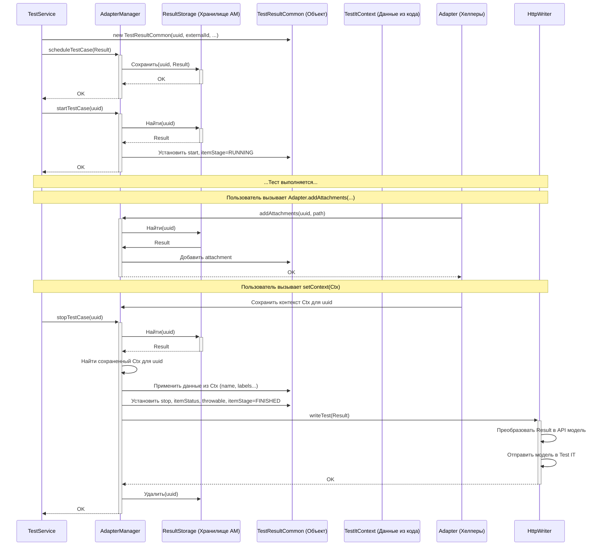

# Chapter 7: Модель Результата Теста (TestResultCommon)


В [предыдущей главе](06_контекст_теста__testitcontext__.md) мы узнали, как можно добавить дополнительную информацию к нашим автотестам с помощью "[стикеров]" — объекта [Контекст Теста (TestItContext)](06_контекст_теста__testitcontext__.md). Мы можем указать пользовательское имя, метки, ссылки на ручные тесты и многое другое.

Но куда вся эта информация попадает? Где хранится статус теста (успех/провал), время его выполнения, возможные ошибки и все те "стикеры", которые мы добавили? Ответ — в **Модели Результата Теста (`TestResultCommon`)**.

Представьте, что вы заполняете отчет по итогам работы сотрудника за день. Вам нужна одна карточка, где будет собрана вся информация: ФИО, должность, выполненные задачи, время начала и конца работы, статусы (успешно/неудачно), любые комментарии или прикрепленные документы. `TestResultCommon` — это и есть такая всеобъемлющая **"карточка" для одного автотеста**, которая содержит абсолютно всё, что нужно знать адаптеру для отправки полного отчета в Test IT.

## Зачем нужна `TestResultCommon`? Центральное хранилище информации

Во время выполнения теста адаптер собирает множество данных из разных источников:

*   **Тестовый фреймворк (Kotest):** Дает имя теста, имя класса, статус (успех/провал/игнор), сообщение об ошибке.
*   **Адаптер:** Генерирует уникальные ID, замеряет время начала и конца, обрабатывает шаги и вложения.
*   **Пользователь (через `TestItContext` или аннотации):** Предоставляет `externalId`, `workItemIds`, пользовательские имена, описания, метки, ссылки.

Чтобы отправить всё это в Test IT единым пакетом, нужна структура, которая сможет **агрегировать** (собрать воедино) всю эту разнообразную информацию. `TestResultCommon` — это именно такая структура данных (data class в Kotlin). Она выступает как центральный "контейнер" для всех сведений об одном конкретном выполненном автотесте.

## Что хранится в "карточке" `TestResultCommon`?

Давайте заглянем внутрь этой "карточки" и посмотрим на её основные поля. Это не полный список, но он дает представление о том, какие данные она содержит:

*   `uuid: String?` 🤔
    *   **Что это:** Уникальный внутренний идентификатор (UUID), который адаптер присваивает каждому результату теста. Он используется внутри адаптера для отслеживания.
    *   **Зачем:** Чтобы различать результаты разных тестов, даже если у них одинаковые имена.

*   `externalId: String` 🆔
    *   **Что это:** Уникальный идентификатор теста, который используется для **связи** с тест-кейсом в Test IT. Обычно формируется из имени класса и имени метода/теста.
    *   **Зачем:** Чтобы Test IT понял, к какому именно тест-кейсу относится этот результат.

*   `workItemIds: MutableList<String>` 📄
    *   **Что это:** Список строковых идентификаторов (не UUID) ручных тест-кейсов в Test IT, с которыми связан этот автотест.
    *   **Зачем:** Чтобы связать результат автотеста с существующими ручными тест-кейсами.

*   `name: String` / `title: String` / `description: String` 📝
    *   **Что это:** Названия и описания теста, которые будут отображаться в Test IT. `name` часто совпадает с `externalId`, `title` — это заголовок, а `description` — подробное описание.
    *   **Зачем:** Чтобы отчеты в Test IT были понятными и читаемыми. Эти поля можно задать через [TestItContext](06_контекст_теста__testitcontext__.md).

*   `className: String` / `spaceName: String` 📦
    *   **Что это:** Имя класса и имя пакета (namespace), в котором находится тест.
    *   **Зачем:** Для группировки и навигации в Test IT.

*   `itemStatus: ItemStatus?` ✅ / ❌ / ❓
    *   **Что это:** Финальный статус выполнения теста (`PASSED`, `FAILED`, `SKIPPED`).
    *   **Зачем:** Самое главное — показать, прошел тест или нет.

*   `itemStage: ItemStage?` 🏃 /🏁
    *   **Что это:** Текущая стадия жизненного цикла теста (`RUNNING`, `FINISHED`).
    *   **Зачем:** Внутреннее поле, помогает адаптеру понять, выполняется ли тест сейчас или уже завершен.

*   `start: Long` / `stop: Long` ⏱️
    *   **Что это:** Временные метки (в миллисекундах) начала и окончания выполнения теста.
    *   **Зачем:** Для расчета длительности теста и отображения в отчетах.

*   `throwable: Throwable?` 💥
    *   **Что это:** Объект исключения (ошибки), если тест упал.
    *   **Зачем:** Чтобы сохранить детальную информацию об ошибке (стек-трейс) для анализа.

*   `steps: MutableList<StepResult>` 🚶‍♂️🚶‍♀️
    *   **Что это:** Список результатов выполнения шагов внутри теста (если ваш тест разбит на шаги с помощью аннотаций `@Step`).
    *   **Зачем:** Для отображения детальной структуры теста в Test IT.

*   `attachments: MutableList<String>` 📎
    *   **Что это:** Список уникальных идентификаторов (UUID) вложений (например, скриншотов, логов), которые были прикреплены к тесту во время выполнения.
    *   **Зачем:** Чтобы прикрепить файлы к результату теста в Test IT.

*   `linkItems: MutableList<LinkItem>` / `resultLinks: MutableList<LinkItem>` 🔗
    *   **Что это:** Списки ссылок. `linkItems` обычно содержат ссылки, определенные статически (например, через аннотации), а `resultLinks` — ссылки, добавленные динамически во время выполнения теста.
    *   **Зачем:** Чтобы связать тест с внешними ресурсами (например, баг-трекером).

*   `labels: MutableList<Label>` 🏷️
    *   **Что это:** Список меток (тэгов), присвоенных тесту.
    *   **Зачем:** Для категоризации и фильтрации тестов в Test IT.

*   `parameters: MutableMap<String, String>` 📊
    *   **Что это:** Карта (словарь) параметров, с которыми был запущен тест (актуально для параметризованных тестов).
    *   **Зачем:** Чтобы видеть, с какими входными данными тест выполнялся.

*   `automaticCreationTestCases: Boolean` ✨
    *   **Что это:** Флаг, указывающий, нужно ли автоматически создавать тест-кейс в Test IT, если он не найден по `externalId`.
    *   **Зачем:** Берется из [конфигурации](02_конфигурация_адаптера_и_клиента__adapterconfig__clientconfiguration__.md), чтобы управлять созданием тестов.

Как видите, `TestResultCommon` — это действительно подробная "карточка", собирающая всё в одном месте.

## Как используется `TestResultCommon`? (Кто её заполняет?)

Важно понимать: вы, как разработчик тестов, **обычно не создаете и не заполняете `TestResultCommon` напрямую**. Этим занимаются компоненты адаптера "за кулисами":

1.  **Создание:** Когда [TestItWriter](04_запись_результатов__testitwriter__.md) получает сигнал о начале теста, он делегирует работу [Сервису Тестов (TestService)](05_сервис_тестов__testservice__.md). Именно `TestService` создает пустой или частично заполненный объект `TestResultCommon`, извлекая начальную информацию (имя, класс, `externalId`) из данных Kotest.
2.  **Планирование и Запуск:** `TestService` передает этот объект [Менеджеру Адаптера (AdapterManager)](01_менеджер_адаптера__adaptermanager__.md) сначала для "планирования" (`scheduleTestCase`), а затем для фактического старта (`startTestCase`). `AdapterManager` сохраняет его в своем хранилище (`ResultStorage`) и устанавливает время `start` и `itemStage` в `RUNNING`.
3.  **Обновление в процессе:** Во время выполнения теста:
    *   Если вы добавляете вложения (`Adapter.addAttachments(...)`) или ссылки (`Adapter.addLinks(...)`), эти вызовы в конечном итоге приводят к тому, что `AdapterManager` находит текущий `TestResultCommon` в хранилище и добавляет туда ID вложений или ссылки.
    *   Если вы используете `testCase.setContext(...)` ([TestItContext](06_контекст_теста__testitcontext__.md)), эти данные временно сохраняются.
4.  **Завершение:** Когда тест заканчивается, [TestItWriter](04_запись_результатов__testitwriter__.md) снова вызывает [TestService](05_сервис_тестов__testservice__.md), который передает результат (успех/провал/игнор) и ошибку (если есть) в `AdapterManager` (`updateTestCase`, `stopTestCase`). `AdapterManager` делает финальные штрихи:
    *   Устанавливает `itemStatus`, `throwable`, `stop` и `itemStage` в `FINISHED`.
    *   **Применяет** данные из сохраненного [TestItContext](06_контекст_теста__testitcontext__.md) (имя, метки, `workItemIds` и т.д.), обновляя соответствующие поля в `TestResultCommon`.
5.  **Отправка:** Наконец, полностью заполненный `TestResultCommon` передается компоненту [Запись Результатов (например, HttpWriter)](08_запись_результатов_по_http__httpwriter__.md), который преобразует его (`Converter`) в специальный формат для API Test IT и отправляет по сети с помощью [API Клиента TMS (TmsApiClient)](09_api_клиент_tms__tmsapiclient__.md).

Таким образом, `TestResultCommon` проходит через весь конвейер адаптера, постепенно наполняясь данными от разных источников.

## Под капотом: Жизненный цикл `TestResultCommon`

Давайте посмотрим на путь одного `TestResultCommon` объекта:



Эта диаграмма показывает, как объект `TestResultCommon` создается, обновляется различными компонентами (`AdapterManager`, хелперы `Adapter` под влиянием `TestItContext`) и в итоге передается `Writer` для отправки.

### Взгляд в код

1.  **Определение `TestResultCommon`:**
    Это просто класс данных (data class) со множеством полей.

    ```kotlin
    // Файл: testit-kotlin-commons/src/main/kotlin/ru/testit/models/TestResultCommon.kt
    package ru.testit.models

    import kotlinx.serialization.Contextual // Для сериализации ошибок
    import kotlinx.serialization.Serializable // Для возможности сериализации

    @Serializable // Позволяет преобразовывать объект в JSON и обратно
    data class TestResultCommon(
        // --- Идентификаторы ---
        var uuid: String? = null, // Внутренний UUID
        var externalId: String = "", // ID для Test IT
        var workItemIds: MutableList<String> = mutableListOf(), // ID ручных тестов

        // --- Метаданные теста ---
        var className: String = "", // Имя класса
        var spaceName: String = "", // Имя пакета
        var name: String = "", // Отображаемое имя
        var title: String = "", // Заголовок
        var description: String = "", // Описание
        var labels: MutableList<Label> = mutableListOf(), // Метки

        // --- Ссылки и Вложения ---
        var linkItems: MutableList<LinkItem> = mutableListOf(), // Ссылки
        var resultLinks: MutableList<LinkItem> = mutableListOf(), // Динамические ссылки
        var attachments: MutableList<String> = mutableListOf(), // UUID вложений

        // --- Результат и Время ---
        var itemStatus: ItemStatus? = null, // PASSED / FAILED / SKIPPED
        private var itemStage: ItemStage? = null, // RUNNING / FINISHED
        var start: Long = 0L, // Время начала (мс)
        var stop: Long = 0L, // Время конца (мс)
        @Contextual var throwable: Throwable? = null, // Ошибка

        // --- Структура и Параметры ---
        private var steps: MutableList<StepResult> = mutableListOf(), // Шаги
        val parameters: MutableMap<String, String> = mutableMapOf(), // Параметры

        // --- Настройки адаптера ---
        var automaticCreationTestCases: Boolean = false // Флаг авто-создания

        // ... (методы для работы со stage и steps) ...
    ) : ResultWithSteps { // Реализует интерфейс для работы с шагами
        // ...
    }
    ```
    *Объяснение:* Это определение класса, который просто содержит все поля, необходимые для описания результата теста. Аннотация `@Serializable` важна для преобразования этого объекта в JSON при отправке через API.

2.  **Создание в `TestService`:**
    `TestService` собирает начальную информацию и создает экземпляр.

    ```kotlin
    // Файл: testit-adapter-kotest/src/main/kotlin/ru/testit/services/TestService.kt
    // Внутри метода onTestStart(testCase: TestCase, uuid: String)

    // ... (получение имени, класса, пакета) ...
    var fullName = formatter.formatTestPath(testCase, " / ")
    var spaceName : String = testCase.spec.javaClass.packageName
    var className: String = testCase.spec.javaClass.simpleName

    // Создаем объект TestResultCommon
    val result = TestResultCommon(
        uuid = uuid, // Устанавливаем внутренний UUID
        className = className,
        name = testCase.name.testName, // Используем имя из Kotest
        spaceName = spaceName,
        externalId = Utils.genExternalID(fullName), // Генерируем externalId
        labels = Utils.defaultLabels(), // Начальные метки (если есть)
        linkItems = Utils.defaultLinks() // Начальные ссылки (если есть)
        // Остальные поля пока пустые или со значениями по умолчанию
    )

    // Передаем созданный объект дальше в AdapterManager
    adapterManager.scheduleTestCase(result)
    adapterManager.startTestCase(uuid)
    ```
    *Объяснение:* Здесь мы видим, как `TestService` заполняет основные идентификаторы и метаданные при создании `TestResultCommon`.

3.  **Обновление в `AdapterManager` (концептуально):**
    `AdapterManager` модифицирует объект при старте и остановке.

    ```kotlin
    // Концептуальный пример внутри AdapterManager

    fun startTestCase(uuid: String) {
        val result = storage.getTestResult(uuid).get() // Получаем объект из хранилища
        result.start = System.currentTimeMillis() // Устанавливаем время старта
        result.setItemStage(ItemStage.RUNNING)    // Устанавливаем стадию "Выполняется"
        // ... (сохраняем обновленный result обратно) ...
    }

    fun stopTestCase(uuid: String) {
        val result = storage.getTestResult(uuid).get() // Получаем объект
        result.stop = System.currentTimeMillis() // Устанавливаем время стопа
        result.setItemStage(ItemStage.FINISHED)   // Устанавливаем стадию "Завершен"

        // ... (применяем статус, ошибку, данные из TestItContext перед этим) ...

        writer?.writeTest(result) // Передаем финальный объект Writer'у
    }
    ```
    *Объяснение:* Этот псевдокод показывает, как `AdapterManager` обновляет временные метки и стадию жизненного цикла объекта `TestResultCommon`.

4.  **Применение `TestItContext` (через `Consumer`):**
    Как мы видели в [Главе 6](06_контекст_теста__testitcontext__.md), специальные `Consumer`-ы используются для обновления `TestResultCommon` данными из `TestItContext`.

    ```kotlin
    // Файл: testit-adapter-kotest/src/main/kotlin/ru/testit/listener/Consumers.kt
    object Consumers {
        fun setContext(context: TestItContext): Consumer<TestResultCommon> {
            // Возвращает лямбду, которая будет применена к TestResultCommon
            return Consumer<TestResultCommon> { result: TestResultCommon ->
                // Обновляем поля result значениями из context, если они не null
                result.externalId = context.externalId ?: result.externalId
                result.description = context.description ?: result.description
                result.workItemIds = context.workItemIds ?: result.workItemIds
                result.name = context.name ?: result.name
                // ... и так далее для всех полей из TestItContext ...
            }
        }
    }

    // Используется примерно так в AdapterManager.updateTestCase:
    // val context = storage.getContextFor(uuid) // Получаем сохраненный контекст
    // updateTestCase(uuid, Consumers.setContext(context)) // Применяем его
    ```
    *Объяснение:* Лямбда `setContext` берет данные из `TestItContext` и перезаписывает ими соответствующие поля в `TestResultCommon`, позволяя кастомизировать результат.

5.  **Преобразование для отправки (`Converter`):**
    Перед отправкой в Test IT, `HttpWriter` использует `Converter`, чтобы преобразовать `TestResultCommon` в модель, понятную API.

    ```kotlin
    // Файл: testit-kotlin-commons/src/main/kotlin/ru/testit/writers/Converter.kt
    class Converter {
        companion object {
            // Метод для конвертации TestResultCommon в модель для API
            fun testResultToAutoTestResultsForTestRunModel(
                result: TestResultCommon,       // Наш объект TestResultCommon
                configurationId: UUID?,
                setupResults: List</*...*/>?,  // Результаты setup-фикстур
                teardownResults: List</*...*/>? // Результаты teardown-фикстур
            ): AutoTestResultsForTestRunModel { // Модель API

                val throwable = result.throwable
                // Создаем модель API, копируя данные из TestResultCommon
                val model = AutoTestResultsForTestRunModel(
                    configurationId = configurationId ?: UUID.fromString(result.uuid),
                    autoTestExternalId = result.externalId, // Берем externalId
                    outcome = AvailableTestResultOutcome.valueOf(result.itemStatus!!.value), // Конвертируем статус
                    links = convertPostLinks(result.resultLinks), // Конвертируем ссылки
                    startedOn = dateToOffsetDateTime(result.start), // Конвертируем время старта
                    completedOn = dateToOffsetDateTime(result.stop), // Конвертируем время стопа
                    duration = result.stop - result.start, // Рассчитываем длительность
                    stepResults = convertResultStep(result.getSteps()), // Конвертируем шаги
                    attachments = convertAttachments(result.attachments), // Конвертируем вложения
                    parameters = result.parameters, // Копируем параметры
                    message = if (throwable != null) throwable.message else result.message, // Берем сообщение об ошибке
                    traces = throwable?.stackTraceToString(), // Берем стек-трейс
                    setupResults = setupResults, // Добавляем результаты setup
                    teardownResults = teardownResults // Добавляем результаты teardown
                )
                return model
            }
            // ... (вспомогательные методы convert..., dateToOffsetDateTime) ...
        }
    }

    // Используется в HttpWriter.writeTest:
    // val model = Converter.testResultToAutoTestResultsForTestRunModel(...)
    // apiClient.sendTestResults(..., model)
    ```
    *Объяснение:* `Converter` — это мост между внутренней моделью адаптера (`TestResultCommon`) и моделью данных, которую ожидает API Test IT (`AutoTestResultsForTestRunModel`). Он копирует и преобразует данные из одного формата в другой.

## Ключевые зависимости `TestResultCommon`

С объектом `TestResultCommon` взаимодействуют многие части адаптера:

*   **[Сервис Тестов (TestService)](05_сервис_тестов__testservice__.md):** Создает начальный экземпляр `TestResultCommon`.
*   **[Менеджер Адаптера (AdapterManager)](01_менеджер_адаптера__adaptermanager__.md):** Управляет жизненным циклом `TestResultCommon`, обновляет его статус, время, применяет контекст.
*   **[Контекст Теста (TestItContext)](06_контекст_теста__testitcontext__.md):** Служит источником дополнительных метаданных, которые вливаются в `TestResultCommon`.
*   **`StepService`:** Добавляет результаты шагов (`StepResult`) в поле `steps` объекта `TestResultCommon`.
*   **`FixtureService`:** Хотя напрямую не модифицирует, результат его работы (ошибка в `before/after`) влияет на финальный `itemStatus` и `throwable` в `TestResultCommon`.
*   **Хелперы `Adapter` (`addAttachments`, `addLinks` и т.д.):** Опосредованно (через `AdapterManager`) добавляют данные в `TestResultCommon`.
*   **[Запись Результатов по HTTP (HttpWriter)](08_запись_результатов_по_http__httpwriter__.md) (или другой `Writer`):** Получает финальный `TestResultCommon` для отправки.
*   **`Converter`:** Преобразует `TestResultCommon` в формат, понятный API Test IT.

## Заключение

Мы подробно рассмотрели `TestResultCommon` — центральную модель данных, представляющую результат одного выполненного автотеста. Она как подробная карточка, которая агрегирует всю информацию: от идентификаторов и статуса до временных меток, ошибок, шагов, вложений и пользовательских данных из [TestItContext](06_контекст_теста__testitcontext__.md). Хотя вы не работаете с ней напрямую, понимание её структуры и полей помогает понять, какие данные собирает и отправляет адаптер. Она наполняется информацией на разных этапах работы адаптера и в итоге используется компонентом `Writer` для отправки отчета в Test IT.

Теперь, когда мы знаем, *что* именно отправляется (полностью заполненный `TestResultCommon`), самое время узнать, *как* происходит сам процесс отправки этих данных по сети.

**Далее:** [Глава 8: Запись Результатов по HTTP (HttpWriter)](08_запись_результатов_по_http__httpwriter__.md)

---

Generated by [AI Codebase Knowledge Builder](https://github.com/The-Pocket/Tutorial-Codebase-Knowledge)