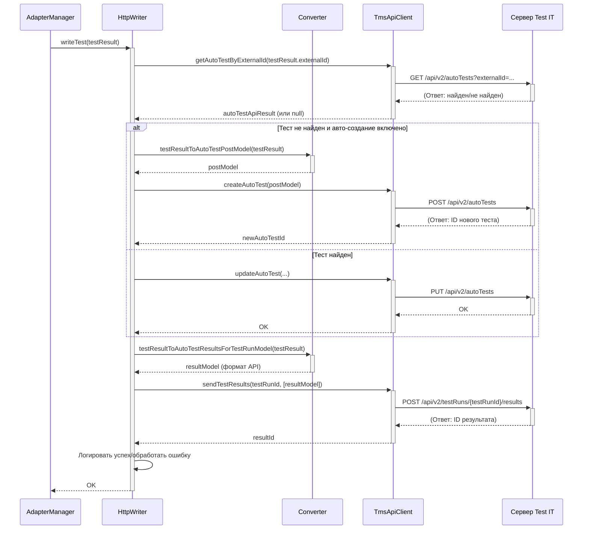

# Chapter 8: Запись Результатов по HTTP (HttpWriter)


В [предыдущей главе](07_модель_результата_теста__testresultcommon__.md) мы подробно рассмотрели "карточку" автотеста — [Модель Результата Теста (`TestResultCommon`)](07_модель_результата_теста__testresultcommon__.md), которая собирает всю информацию о его выполнении. Мы теперь знаем *что* именно адаптер готовит к отправке. Но как эта информация физически попадает с вашего компьютера на сервер Test IT? Кто занимается "упаковкой" и "доставкой"?

За эту финальную часть отвечает компонент **`HttpWriter`**. Представьте себе склад (ваш компьютер с результатами тестов). [`TestResultCommon`](07_модель_результата_теста__testresultcommon__.md) — это готовый товар (карточка с результатами). [`HttpWriter`](08_запись_результатов.md) — это **упаковщик и экспедитор** на этом складе. Его задача:

1.  **Взять** готовую "карточку" (`TestResultCommon`) из хранилища.
2.  **Упаковать** её по специальным правилам службы доставки (преобразовать в формат, понятный API Test IT).
3.  **Передать** упакованную посылку курьеру ([`API Клиент TMS (TmsApiClient)`](09_api_клиент_tms__tmsapiclient__.md)), который и осуществит доставку (отправит данные по HTTP).

## Зачем нужен `HttpWriter`? Финальный этап отправки

Когда [Менеджер Адаптера (`AdapterManager`)](01_менеджер_адаптера.md) решает, что вся информация о тесте (`TestResultCommon`) собрана и тест завершен (`stopTestCase`), он не отправляет данные в Test IT напрямую. Он делегирует эту задачу `Writer`-у. В большинстве конфигураций по умолчанию этим `Writer`-ом является `HttpWriter`.

Основные задачи `HttpWriter`:

*   **Преобразование данных:** Внутренняя модель [`TestResultCommon`](07_модель_результата_теста__testresultcommon__.md) удобна для работы адаптера, но API Test IT ожидает данные в другом формате (например, в виде JSON-объектов с определенной структурой, таких как `AutoTestResultsForTestRunModel`). `HttpWriter` использует специальный `Converter` для этого преобразования.
*   **Взаимодействие с API:** Он использует [API Клиент TMS (`TmsApiClient`)](09_api_клиент_tms__tmsapiclient__.md) для реальной отправки данных (преобразованных моделей) на сервер Test IT по протоколу HTTP.
*   **Работа с автотестами:** Перед отправкой результатов `HttpWriter` проверяет, существует ли соответствующий автотест в Test IT по его `externalId`. Если нет, и в [конфигурации](02_конфигурация_адаптера.md) включено авто-создание, он попросит `ApiClient` создать его. Если тест уже существует, он может его обновить.
*   **Отправка вложений:** Если к тесту были прикреплены файлы (например, скриншоты), `HttpWriter` также отвечает за их загрузку в Test IT и получение их уникальных ID, которые затем связываются с результатом теста.

Без `HttpWriter` компоненту [`AdapterManager`](01_менеджер_адаптера.md) пришлось бы самому знать все детали формата API Test IT и заниматься HTTP-запросами, что сделало бы его слишком сложным. `HttpWriter` инкапсулирует всю логику "последней мили" — подготовки и отправки данных через HTTP.

## Как используется `HttpWriter`? (Роль в цепочке)

Вы, как пользователь адаптера, **никогда не взаимодействуете с `HttpWriter` напрямую**. Он создается и используется внутри адаптера:

1.  **Создание:** При инициализации адаптера (обычно через `Adapter.getAdapterManager()`), создается экземпляр `HttpWriter`, которому передаются необходимые зависимости: [конфигурация клиента](02_конфигурация_адаптера.md) (`ClientConfiguration`) и [API клиент](09_api_клиент_tms__tmsapiclient__.md) (`ApiClient`).
2.  **Передача `AdapterManager`:** Этот экземпляр `HttpWriter` (под интерфейсом `Writer`) передается в конструктор [`AdapterManager`](01_менеджер_адаптера.md).
3.  **Вызов при завершении:** Когда `AdapterManager` завершает тест (`stopTestCase`) или контейнер (`stopClassContainer`, `stopMainContainer`), он вызывает соответствующий метод у `writer` (например, `writer.writeTest(testResult)`), передавая ему готовый объект результата ([`TestResultCommon`](07_модель_результата_теста__testresultcommon__.md) или `ClassContainer`/`MainContainer`).

То есть, `HttpWriter` — это внутренний "рабочий", получающий команды от `AdapterManager`.

**Пример: Что происходит при вызове `writer.writeTest()`?**

1.  [`AdapterManager`](01_менеджер_адаптера.md) вызывает `httpWriter.writeTest(готовыйTestResult)`.
2.  `HttpWriter` получает `готовыйTestResult`.
3.  (`HttpWriter` проверяет, есть ли автотест с `готовыйTestResult.externalId` в Test IT, используя `apiClient`. Если нужно, создает или обновляет его.)
4.  (`HttpWriter` связывает автотест с `workItemIds` из `готовыйTestResult`, если они есть, через `apiClient`.)
5.  `HttpWriter` вызывает `Converter.testResultToAutoTestResultsForTestRunModel(готовыйTestResult, ...)` для преобразования в формат API.
6.  `HttpWriter` вызывает `apiClient.sendTestResults(testRunId, [преобразованныйРезультат])` для отправки по HTTP.
7.  `HttpWriter` обрабатывает ответ от `apiClient` (логирует успех или ошибку).

## Под капотом: Процесс отправки

Давайте визуализируем, как `HttpWriter` отправляет результат одного теста:



Эта диаграмма показывает основные шаги: `HttpWriter` получает `TestResultCommon`, взаимодействует с `TmsApiClient` для проверки/создания/обновления автотеста, использует `Converter` для преобразования данных и затем снова использует `TmsApiClient` для отправки финального результата на сервер Test IT.

### Заглянем в код

**1. Конструктор `HttpWriter`**

Он получает основные зависимости, необходимые для работы.

```kotlin
// Файл: testit-kotlin-commons/src/main/kotlin/ru/testit/writers/HttpWriter.kt

// Импорты...
import ru.testit.clients.ApiClient
import ru.testit.clients.ClientConfiguration
import ru.testit.models.TestResultCommon
import ru.testit.services.ResultStorage
import ru.testit.kotlin.client.models.* // Модели API Test IT
import java.util.UUID

// Класс HttpWriter реализует интерфейс Writer
class HttpWriter(
    // Конфигурация клиента (URL, токен, ID проекта и т.д.)
    private val config: ClientConfiguration,
    // Клиент для общения с API Test IT
    private val apiClient: ApiClient,
    // Хранилище результатов (используется меньше, чем в других частях)
    private val storage: ResultStorage
) : Writer { // Реализует методы интерфейса Writer

    companion object {
        private val LOGGER: Logger = LoggerFactory.getLogger(HttpWriter::class.java)
    }

    // Внутренняя карта для хранения ID результатов, полученных от API
    private val testResults: MutableMap<String, UUID> = HashMap()

    // ... Остальные методы класса ...
}
```

*Объяснение:* Конструктор просто сохраняет переданные ему объекты `ClientConfiguration` (для настроек), `ApiClient` (для HTTP-вызовов) и `ResultStorage`. Он также инициализирует `Logger` и карту `testResults`.

**2. Метод `writeTest` (упрощенно)**

Это основной метод, вызываемый `AdapterManager` для отправки результата одного теста.

```kotlin
// Внутри класса HttpWriter

override fun writeTest(testResultCommon: TestResultCommon) {
    try {
        if (LOGGER.isDebugEnabled()) {
            LOGGER.debug("Write auto test {}", testResultCommon.externalId)
        }

        // 1. Проверяем, существует ли автотест в Test IT по externalId
        val autoTestApiResult = apiClient.getAutoTestByExternalId(testResultCommon.externalId!!)
        val autotest = Converter.convertAutoTestApiResultToAutoTestModel(autoTestApiResult)

        var autoTestId: String? = null

        // 2. Если автотест есть, обновляем его. Если нет - создаем (если разрешено).
        if (autotest != null) {
            // ... (логика обновления AutoTestUpdateApiModel с помощью Converter и apiClient.updateAutoTest) ...
            autoTestId = autotest.id.toString()
        } else {
            // ... (логика создания AutoTestCreateApiModel с помощью Converter и apiClient.createAutoTest, если разрешено) ...
            // autoTestId = apiClient.createAutoTest(model)
        }

        // 3. Связываем автотест с Work Items (если нужно)
        val workItemIds = testResultCommon.workItemIds
        if (!workItemIds.isEmpty() && autoTestId != null) {
             updateTestLinkToWorkItems(autoTestId, workItemIds) // Вызов API через apiClient
        }

        // 4. Преобразуем TestResultCommon в формат API
        val apiModel = Converter.testResultToAutoTestResultsForTestRunModel(
            testResultCommon, UUID.fromString(config.configurationId)
        )

        // 5. Отправляем результат в Test IT
        val resultsToSend: MutableList<AutoTestResultsForTestRunModel> = mutableListOf(apiModel)
        LOGGER.debug("send result by testRunId: " + config.testRunId)
        val ids = apiClient.sendTestResults(config.testRunId, resultsToSend) // Вызов API!

        // Сохраняем ID результата, полученный от API
        testResults[testResultCommon.uuid!!] = UUID.fromString(ids[0])

    } catch (e: Exception) {
        // 6. Обработка ошибок
        LOGGER.error("Can not write the autotest: {}", e.message)
        // ... (логирование деталей ошибки, если нужно) ...
    }
}

//... приватный метод updateTestLinkToWorkItems(autoTestId, workItemIds) ...
```

*Объяснение:*
*   Метод получает `TestResultCommon`.
*   Он использует `apiClient` (наш [TmsApiClient](09_api_клиент_tms__tmsapiclient__.md)) для проверки/создания/обновления автотеста и связи с Work Items.
*   Он использует `Converter` для преобразования `testResultCommon` в `AutoTestResultsForTestRunModel` (модель API).
*   Затем он снова использует `apiClient` для отправки этой модели (`sendTestResults`).
*   В конце — базовая обработка ошибок.

**3. Метод `writeAttachment` (упрощенно)**

Этот метод вызывается, когда пользователь добавляет вложение (`Adapter.addAttachments`).

```kotlin
// Внутри класса HttpWriter

override fun writeAttachment(path: String): String = try {
    // Просто передаем путь к файлу клиенту API
    apiClient.addAttachment(path) // Вызов API!
} catch (e: Exception) {
    LOGGER.error("Can not write attachment: ${e.message}")
    "" // Возвращаем пустую строку в случае ошибки
}
```

*Объяснение:* Этот метод предельно прост. Он получает путь к файлу и напрямую вызывает метод `addAttachment` у `apiClient`, который уже знает, как загрузить файл на сервер Test IT и вернуть его ID. В случае ошибки логируется сообщение и возвращается пустая строка.

## Ключевые зависимости `HttpWriter`

*   **[Менеджер Адаптера (`AdapterManager`)](01_менеджер_адаптера.md):** Вызывает методы `HttpWriter` (например, `writeTest`) для инициирования отправки.
*   **[API Клиент TMS (`TmsApiClient`)](09_api_клиент_tms__tmsapiclient__.md):** Основной инструмент `HttpWriter` для выполнения HTTP-запросов к API Test IT (создание/обновление тестов, отправка результатов, загрузка вложений). Это "курьер".
*   **`Converter`:** Вспомогательный класс, который `HttpWriter` использует для преобразования внутренних моделей (`TestResultCommon`) в модели API (`AutoTestResultsForTestRunModel` и др.). Это "упаковщик".
*   **[Конфигурация Адаптера и Клиента (`ClientConfiguration`)](02_конфигурация_адаптера.md):** Предоставляет `HttpWriter` необходимые настройки для `ApiClient` (URL, токен, testRunId, configurationId).
*   **[`Модель Результата Теста (`TestResultCommon`)`](07_модель_результата_теста__testresultcommon__.md) (и другие модели результатов):** Это входные данные для `HttpWriter` — "товар", который нужно упаковать и отправить.
*   **[`ResultStorage`](#):** Используется опосредованно, в основном для получения информации о фикстурах при записи контейнеров (`writeClass`, `writeTests`), чтобы правильно обновить данные автотеста.

## Заключение

Мы познакомились с `HttpWriter` — компонентом, который находится на самом последнем этапе работы адаптера перед отправкой данных в Test IT. Он берет готовую и полностью заполненную информацию о тесте ([`TestResultCommon`](07_модель_результата_теста__testresultcommon__.md)), использует `Converter` для её "упаковки" в формат API и передает "курьеру" [`TmsApiClient`](09_api_клиент_tms__tmsapiclient__.md) для фактической HTTP-отправки на сервер. Он также отвечает за загрузку вложений и базовую логику создания/обновления автотестов в Test IT.

Теперь, когда мы понимаем роль "упаковщика и экспедитора", логично поближе познакомиться с самим "курьером" — компонентом, который непосредственно общается с сервером Test IT по сети.

**Далее:** [Глава 9: API Клиент TMS (`TmsApiClient`)](09_api_клиент_tms__tmsapiclient__.md)

---

Generated by [AI Codebase Knowledge Builder](https://github.com/The-Pocket/Tutorial-Codebase-Knowledge)