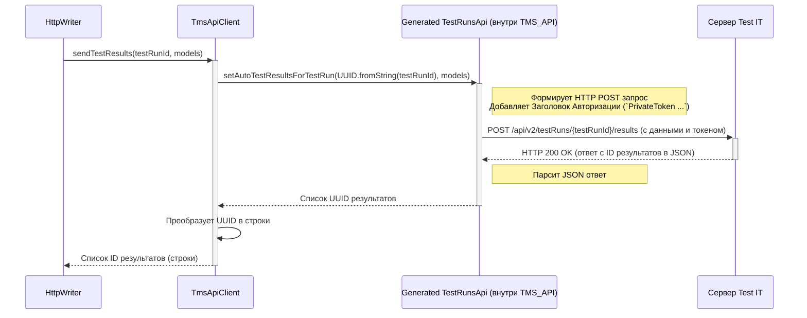

# Chapter 9: API Клиент TMS (TmsApiClient)


В [предыдущей главе](08_запись_результатов.md) мы познакомились с [HttpWriter](0_запись_результатов_по_http__httpwriter__.md) — нашим "упаковщиком и экспедитором", который берет готовый отчет о тесте ([TestResultCommon](07_модель_результата_теста__testresultcommon__.md)), готовит его к отправке и передает дальше. Но кто же фактически доставляет эту "посылку" по адресу, то есть отправляет данные на сервер Test IT?

Эту роль выполняет **API Клиент TMS (`TmsApiClient`)**. Представьте, что `HttpWriter` подготовил и упаковал посылку (данные о тесте). `TmsApiClient` — это **курьер**, который физически берет эту посылку, садится в машину (использует сетевое соединение) и везет ее по указанному адресу (URL вашего Test IT), используя специальный пропуск (API-токен) для входа.

## Зачем нужен `TmsApiClient`? Проблема общения по сети

Все компоненты адаптера, которые мы рассмотрели ранее, работают внутри вашего проекта, на вашем компьютере. Но Test IT — это внешний сервис, обычно находящийся на другом сервере. Чтобы отправить туда данные, нужно:

1.  Установить **сетевое соединение** с сервером Test IT.
2.  Сформировать **HTTP-запрос** (например, `POST` или `GET`) по правилам, которые понимает API Test IT.
3.  **Авторизоваться** на сервере, подтвердив, что у вас есть право отправлять эти данные (используя `privateToken`).
4.  Отправить сами данные (результаты тестов, вложения) в правильном формате (обычно JSON).
5.  Получить и обработать **ответ** от сервера (успех или ошибка).

Делать все это вручную в [HttpWriter](08_запись_результатов.md) было бы очень сложно и громоздко. `TmsApiClient` **инкапсулирует всю эту низкоуровневую работу** с сетью и HTTP. Он предоставляет `HttpWriter` и другим (теоретически) компонентам простые методы вроде `sendTestResults(...)` или `createTestRun()`, а сам "под капотом" выполняет все необходимые сетевые операции.

**Основная задача `TmsApiClient`:** быть мостом между внутренним миром адаптера и внешним API Test IT, скрывая сложности HTTP-протокола и авторизации.

## Что делает `TmsApiClient`? Ключевые Задачи

*   **Отправка HTTP-запросов:** Преобразует вызовы методов (например, `apiClient.sendTestResults(...)`) в конкретные HTTP-запросы (`POST /api/v2/testRuns/{id}/results`) к API Test IT.
*   **Авторизация:** Автоматически добавляет необходимый заголовок `Authorization` с `privateToken` (полученным из [ClientConfiguration](02_конфигурация_адаптера.md)) ко всем исходящим запросам.
*   **Обработка ответов:** Получает ответы от сервера Test IT, разбирает их (например, извлекает ID созданного тест-рана) и возвращает результат вызывающему коду (например, `HttpWriter`).
*   **Обработка ошибок:** Перехватывает сетевые ошибки (`IOException`) или ошибки API (`ClientException`, `ServerException`) и сообщает о них вызывающему коду (обычно через проброс исключения), логируя детали.
*   **Взаимодействие с генерируемым клиентом:** "Под капотом" он использует библиотеку `ru.testit.kotlin.client`, которая автоматически сгенерирована на основе официальной спецификации Test IT API (OpenAPI). `TmsApiClient` служит удобной оберткой над этим генерируемым клиентом.

## Как используется `TmsApiClient`? (Скрытый работник)

Вы, как пользователь адаптера, **практически никогда не будете вызывать методы `TmsApiClient` напрямую**. Он является внутренней деталью реализации адаптера.

Его используют другие компоненты, в первую очередь — [HttpWriter](08_запись_результатов.md), для выполнения своих задач:

```kotlin
// Внутри HttpWriter.kt (упрощенно)

class HttpWriter(
    private val config: ClientConfiguration,
    // Вот здесь HttpWriter получает TmsApiClient!
    private val apiClient: ApiClient, // ApiClient - это интерфейс, TmsApiClient - его реализация
    private val storage: ResultStorage
) : Writer {

    override fun writeTest(testResultCommon: TestResultCommon) {
        try {
            // HttpWriter использует apiClient для проверки автотеста
            val autoTestApiResult = apiClient.getAutoTestByExternalId(testResultCommon.externalId!!)
            // ... (логика создания/обновления автотеста через apiClient) ...

            // HttpWriter использует Converter для подготовки данных
            val apiModel = Converter.testResultToAutoTestResultsForTestRunModel(...)

            // HttpWriter использует apiClient для отправки результата
            val ids = apiClient.sendTestResults(config.testRunId, listOf(apiModel))
            // ...
        } catch (e: Exception) {
            // ... обработка ошибок, полученных от apiClient ...
        }
    }

    override fun writeAttachment(path: String): String = try {
        // HttpWriter использует apiClient для загрузки файла
        apiClient.addAttachment(path)
    } catch (e: Exception) {
        // ... обработка ошибок ...
        ""
    }
}
```

Этот пример показывает, что `HttpWriter` делегирует фактическую сетевую работу (`getAutoTestByExternalId`, `sendTestResults`, `addAttachment`) объекту `apiClient` (которым является `TmsApiClient`).

## Под капотом: Как "курьер" доставляет посылку?

Давайте представим, что `HttpWriter` попросил `TmsApiClient` отправить результаты теста (`sendTestResults`). Что происходит внутри `TmsApiClient`?

1.  **Прием заказа:** `TmsApiClient` получает ID тест-рана и список моделей с результатами от `HttpWriter`.
2.  **Подготовка:** `TmsApiClient` определяет, какой именно метод генерируемого клиента (`TestRunsApi` из библиотеки `ru.testit.kotlin.client`) нужно вызвать для этой операции (в данном случае, `testRunsApi.setAutoTestResultsForTestRun`).
3.  **Авторизация:** При вызове метода генерируемого клиента `TmsApiClient` (через настройки, заданные в `init`) указывает ему использовать `privateToken` из [ClientConfiguration](02_конфигурация_адаптера.md) для формирования заголовка `Authorization: PrivateToken ВАШ_ТОКЕН`.
4.  **Отправка:** Генерируемый клиент `TestRunsApi` формирует полный HTTP `POST` запрос к эндпоинту `/api/v2/testRuns/{testRunId}/results`, включает в тело запроса данные о результатах (в формате JSON) и отправляет его по сети на адрес Test IT (URL из [ClientConfiguration](02_конфигурация_адаптера.md)).
5.  **Ожидание и получение ответа:** `TmsApiClient` (через `TestRunsApi`) ожидает ответ от сервера Test IT. Сервер обрабатывает запрос и отправляет ответ (например, HTTP 200 OK с телом JSON, содержащим ID созданных записей о результатах).
6.  **Обработка ответа:** Генерируемый клиент `TestRunsApi` парсит ответ. `TmsApiClient` получает от него результат (например, список ID).
7.  **Возврат результата:** `TmsApiClient` возвращает полученные ID обратно `HttpWriter`.
8.  **Обработка ошибок:** Если на любом этапе (отправка, получение ответа, парсинг) возникает проблема (нет сети, неверный токен, ошибка сервера), генерируемый клиент выбрасывает исключение (`IOException`, `ClientException`, `ServerException`). `TmsApiClient` перехватывает его, логирует и обычно пробрасывает дальше, чтобы `HttpWriter` мог его обработать.

### Диаграмма последовательности: Отправка результатов



Диаграмма иллюстрирует, как `TmsApiClient` использует генерируемый `TestRunsApi` для фактического взаимодействия с сервером Test IT по HTTP.

### Заглянем в код

**1. Интерфейс `ApiClient`**

Он определяет "контракт" — какие методы должен предоставлять любой клиент API. `TmsApiClient` реализует этот интерфейс.

```kotlin
// Файл: testit-kotlin-commons/src/main/kotlin/ru/testit/clients/ApiClient.kt
package ru.testit.clients

// Импорты моделей и исключений...
import ru.testit.kotlin.client.models.*
import java.util.UUID

// Интерфейс определяет, что должен уметь API клиент
interface ApiClient {
    // Создать новый тест-ран
    fun createTestRun(): TestRunV2ApiResult
    // Отправить результаты тестов
    fun sendTestResults(testRunUuid: String, models: List<AutoTestResultsForTestRunModel>): List<String>
    // Загрузить вложение
    fun addAttachment(path: String): String
    // Получить автотест по его externalId
    fun getAutoTestByExternalId(externalId: String): AutoTestApiResult?
    // Создать новый автотест
    fun createAutoTest(model: AutoTestCreateApiModel): String
    // Обновить существующий автотест
    fun updateAutoTest(model: AutoTestUpdateApiModel)
    // Связать автотест с work item'ами
    fun linkAutoTestToWorkItems(id: String, workItemIds: Iterable<String>)
    // ... и другие методы для работы с API Test IT ...
}
```

*Объяснение:* Этот интерфейс перечисляет основные операции, которые можно выполнить с Test IT через API. `HttpWriter` работает с этим интерфейсом, не зная деталей конкретной реализации (`TmsApiClient`).

**2. Класс `TmsApiClient` (Конструктор и `init`)**

Здесь создаются и настраиваются экземпляры генерируемых клиентов.

```kotlin
// Файл: testit-kotlin-commons/src/main/kotlin/ru/testit/clients/TmsApiClient.kt
package ru.testit.clients

// Импорты логгера, моделей, генерируемых API...
import org.slf4j.LoggerFactory
import ru.testit.kotlin.client.apis.* // Генерируемые API (AttachmentsApi, AutoTestsApi, etc.)
import ru.testit.kotlin.client.infrastructure.ApiClient as GeneratedApiClient // Переименовываем, чтобы не путать
import ru.testit.kotlin.client.models.*
import java.io.File
import java.util.*

// Класс реализует наш интерфейс ApiClient
class TmsApiClient(private val clientConfiguration: ClientConfiguration) : ru.testit.clients.ApiClient {

    private companion object {
        // ... константы ...
        private val LOGGER = LoggerFactory.getLogger(javaClass)
        private const val AUTH_PREFIX = "PrivateToken"
    }

    // Экземпляры генерируемых клиентов для разных частей API
    private val testRunsApi: TestRunsApi
    private val autoTestsApi: AutoTestsApi
    private val attachmentsApi: AttachmentsApi
    private val testResultsApi: TestResultsApi

    init {
        // Создаем экземпляры генерируемых клиентов, передавая им URL сервера
        testRunsApi = TestRunsApi(clientConfiguration.url)
        init(testRunsApi) // Настраиваем клиент
        autoTestsApi = AutoTestsApi(clientConfiguration.url)
        init(autoTestsApi) // Настраиваем клиент
        attachmentsApi = AttachmentsApi(clientConfiguration.url)
        init(attachmentsApi) // Настраиваем клиент
        testResultsApi = TestResultsApi(clientConfiguration.url)
        init(testResultsApi) // Настраиваем клиент
    }

    // Метод для настройки каждого генерируемого клиента
    fun init(client: GeneratedApiClient ) {
        // Устанавливаем префикс для токена авторизации
        client.apiKeyPrefix["Authorization"] = AUTH_PREFIX
        // Устанавливаем сам токен авторизации из конфигурации
        client.apiKey["Authorization"] = clientConfiguration.privateToken
        // Устанавливаем, нужно ли проверять SSL сертификат сервера
        client.verifyingSsl = clientConfiguration.certValidation
    }

    // ... Реализации методов интерфейса ApiClient ...
}
```

*Объяснение:*
*   Конструктор получает `ClientConfiguration`.
*   Блок `init` создает экземпляры классов `TestRunsApi`, `AutoTestsApi` и т.д. (это классы из библиотеки `ru.testit.kotlin.client`).
*   Приватный метод `init` настраивает каждый из этих генерируемых клиентов: указывает им URL сервера, как добавлять токен авторизации (`privateToken`) и нужно ли проверять SSL.

**3. Реализация метода `sendTestResults` (упрощенно)**

Пример того, как метод `TmsApiClient` вызывает метод генерируемого клиента.

```kotlin
// Внутри класса TmsApiClient

override fun sendTestResults(
    testRunUuid: String,
    models: List<AutoTestResultsForTestRunModel>
): List<String> { // Возвращает список ID (строки)
    try {
        // Вызываем метод setAutoTestResultsForTestRun у сгенерированного testRunsApi
        // Передаем ему UUID тест-рана и список моделей
        val resultUuids = testRunsApi.setAutoTestResultsForTestRun(
            UUID.fromString(testRunUuid), // Преобразуем строку ID в UUID
            models // Передаем модели как есть
        )
        // Преобразуем полученные UUID в строки и возвращаем
        return resultUuids.map { it.toString() }
    } catch (e: Exception) {
        // Логируем ошибку, если что-то пошло не так
        LOGGER.error("Failed to send test results for test run $testRunUuid", e)
        // Пробрасываем исключение дальше
        throw e
    }
}
```

*Объяснение:* Метод просто вызывает соответствующий метод `setAutoTestResultsForTestRun` у объекта `testRunsApi` (который был создан и настроен в `init`). Он также оборачивает вызов в `try-catch` для базового логирования ошибок и преобразования UUID ответа в строки.

**4. Реализация метода `addAttachment` (упрощенно)**

Еще один пример делегирования работы генерируемому клиенту.

```kotlin
// Внутри класса TmsApiClient

override fun addAttachment(path: String): String { // Возвращает ID вложения (строка)
    val file = File(path) // Создаем объект File из пути
    try {
        // Вызываем метод apiV2AttachmentsPost у сгенерированного attachmentsApi
        var model = attachmentsApi.apiV2AttachmentsPost(file) // Передаем файл
        // Возвращаем ID загруженного файла из ответа
        return model.id.toString()
    } catch (e: Exception) {
        // Логируем ошибку
        LOGGER.error("Failed to upload attachment from path $path", e)
        // Пробрасываем исключение
        throw e
    }
}
```

*Объяснение:* Аналогично предыдущему примеру, этот метод использует соответствующий генерируемый клиент (`attachmentsApi`) и его метод (`apiV2AttachmentsPost`) для выполнения реальной работы по загрузке файла.

## Ключевые зависимости `TmsApiClient`

*   **[Запись Результатов по HTTP (HttpWriter)](08_запись_результатов.md) (или другой `Writer`):** Основной "потребитель" `TmsApiClient`, вызывает его методы для отправки данных.
*   **[Конфигурация Адаптера и Клиента (`ClientConfiguration`)](02_конфигурация_адаптера.md):** Предоставляет `TmsApiClient` URL сервера Test IT, `privateToken` и другие настройки, необходимые для подключения и авторизации.
*   **Библиотека `ru.testit.kotlin.client`:** Набор автоматически сгенерированных классов (например, `TestRunsApi`, `AutoTestsApi`, модели API), которые `TmsApiClient` использует для непосредственного формирования и отправки HTTP-запросов и обработки ответов. Это "движок" под капотом.

## Заключение

Мы рассмотрели`TmsApiClient` — компонент, отвечающий за самое низкоуровневое взаимодействие с API Test IT. Он действует как "курьер", который берет подготовленные данные ([`HttpWriter`](08_запись_результатов.md) передает их ему) и доставляет их на сервер Test IT, используя HTTP, авторизуясь с помощью токена и обрабатывая ответы и ошибки. Он скрывает сложности сетевого взаимодействия от остальной части адаптера, предоставляя удобный интерфейс (`ApiClient`) для работы с Test IT.

На этом мы завершаем обзор основных компонентов адаптера `adapters-kotlin`. Мы прошли путь от [Менеджера Адаптера (`AdapterManager`)](01_менеджер_адаптера.md), который всем руководит, через [конфигурацию](02_конфигурация_адаптера.md), [репортер](03_репортер.md), который слушает тесты, [писателя](04_запись_результатов.md) и [сервисы](05_сервис_тестов__testservice__.md), которые обрабатывают события, [контекст](06_контекст_теста__testitcontext__.md) для добавления деталей, [модель результата](07_модель_результата_теста__testresultcommon__.md), которая все хранит, и, наконец, до [HttpWriter](08_запись_результатов.md) и `TmsApiClient`, которые отвечают за финальную отправку данных в Test IT. Надеемся, это путешествие помогло вам лучше понять, как работает адаптер "под капотом"!

---

Generated by [AI Codebase Knowledge Builder](https://github.com/The-Pocket/Tutorial-Codebase-Knowledge)