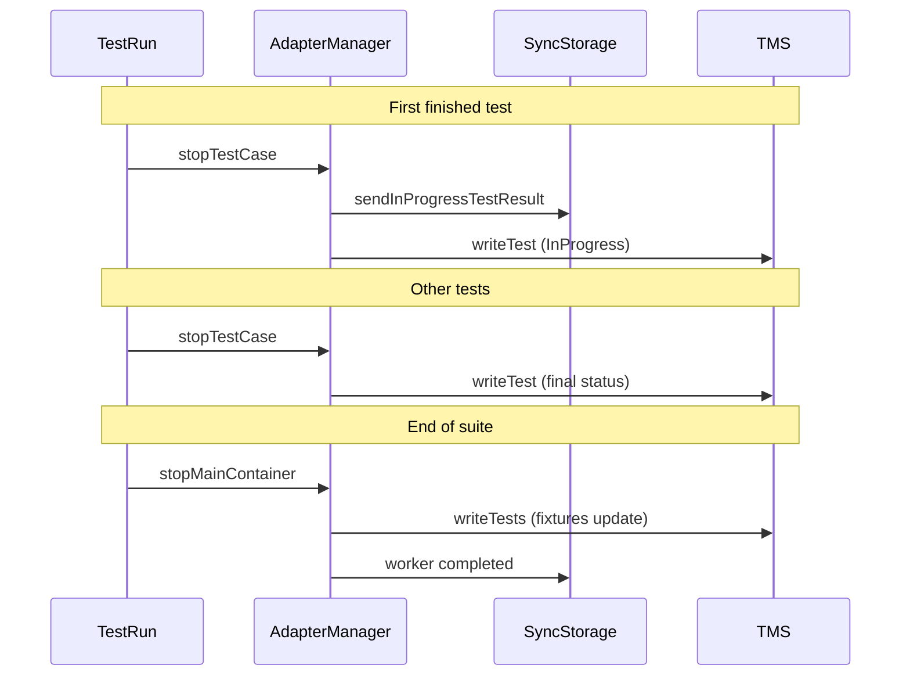
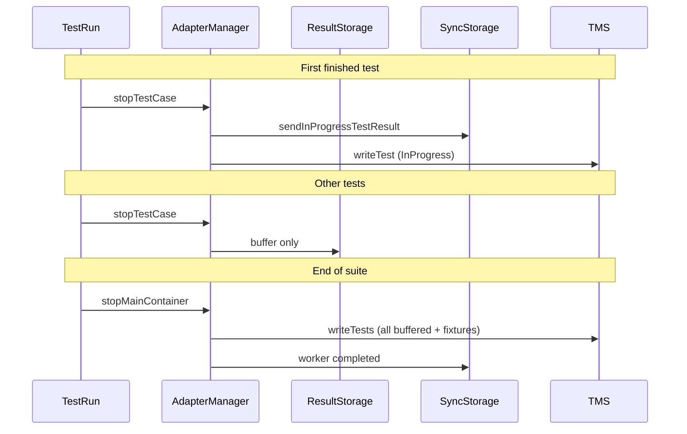

# importRealtime

Specification for real-time vs deferred test result upload in Kotlin adapters.

## Summary

`importRealtime` controls **when** test results (except the first in-progress signal) are sent to TMS.

| Value | Mode | Description |
|-------|------|-------------|
| `true` (default) | Real-time | Each finished test is uploaded to TMS immediately. Sync Storage publishes the first test as `InProgress`. |
| `false` | Deferred | Test results are buffered locally during the run and uploaded in a single batch at the end of the test suite, together with fixtures. Sync Storage behavior for the first test is unchanged. |

Sync Storage is **not** disabled by `importRealtime=false`. It still handles the first-test `InProgress` flow.

## Configuration

| Description | File property | Environment variable | System property |
|-------------|---------------|----------------------|-----------------|
| Real-time upload mode. Default: `true` | `importRealtime` | `TMS_IMPORT_REALTIME` | `tmsImportRealtime` |
| Sync Storage port. Default: `49152` | `syncStoragePort` | `TMS_SYNC_STORAGE_PORT` | `tmsSyncStoragePort` |

### testit.properties example

```properties
importRealtime=true
syncStoragePort=49152
```

### Environment example

```bash
export TMS_IMPORT_REALTIME=false
export TMS_SYNC_STORAGE_PORT=49152
```

Parsing rule: any value other than explicit `"false"` is treated as `true`.

## Behavior

### importRealtime = true (default)

Current real-time mode. No change from pre-1.0 deferred-batch behavior for individual tests.



Steps:

1. **First finished test** (master worker, Sync Storage ready):
   - Cut model sent to Sync Storage
   - Full result sent to TMS with status `InProgress`
   - Final status is **not** sent at test end

2. **Subsequent tests**:
   - Sent to TMS immediately via `HttpWriter.writeTest` with final status (`Passed`, `Failed`, `Skipped`)

3. **End of suite** (`stopMainContainer`):
   - `HttpWriter.writeTests` updates already uploaded results with `beforeAll` / `beforeClass` / `beforeEach` / `afterEach` / `afterClass` / `afterAll` fixtures
   - `writeClass` runs at class container stop

### importRealtime = false

Deferred batch mode.



Steps:

1. **First finished test** — same as real-time mode (Sync Storage + TMS `InProgress`).

2. **Subsequent tests**:
   - Stored in `ResultStorage` only
   - `writeTest` is **not** called
   - `writeClass` is **not** called at class container stop

3. **End of suite** (`stopMainContainer`):
   - `HttpWriter.writeTests` sends all buffered tests in one pass:
     - create/update autotest metadata with fixture definitions
     - if a test result already exists in the test run (e.g. first test was `InProgress` via Sync Storage), **`updateTestResult`** is used
     - otherwise `sendTestResults` creates a new result with final status and fixture results

## Fixtures and attachments

During the run, fixtures are always collected in memory:

- `MainContainer`: `beforeMethods`, `afterMethods`
- `ClassContainer`: `beforeClassMethods`, `afterClassMethods`, `beforeEachTest`, `afterEachTest`

| importRealtime | Fixture API calls during run | Fixture upload |
|----------------|------------------------------|----------------|
| `true` | `writeClass` at class stop; `writeTests` at suite stop | Incremental + final update |
| `false` | None during run | Single batch in `writeTests` at suite stop |

Attachments uploaded via `Adapter.addAttachments` during a test are stored by id on the test result. They are included when the result is finally sent (immediate or deferred).

## Implementation reference

| Component | Role |
|-----------|------|
| `AdapterConfig.shouldImportRealtime()` | Reads `importRealtime` flag |
| `AdapterManager.stopTestCase()` | Sync Storage path always; skips `writeTest` when `importRealtime=false` |
| `AdapterManager.stopClassContainer()` | Calls `writeClass` only when `importRealtime=true` |
| `AdapterManager.stopMainContainer()` | Always calls `writeTests` |
| `HttpWriter.publishTestResultAtEnd()` | Batch send/update for buffered tests with fixtures |
| `ApiClient.getTestResultIdByExternalId()` | Resolves existing test result in run to avoid duplicate launches |
| `SyncStorageRunner` | Unchanged; started regardless of `importRealtime` |

## CI example

The repository e2e workflow runs both modes in one job. See [`.github/workflows/test.yml`](../.github/workflows/test.yml):

1. **Step `Test`** — `TMS_IMPORT_REALTIME=true` (default)
2. **Step `Test importRealtime=false`** — sets `TMS_IMPORT_REALTIME=false`, reuses the Sync Storage binary, kills the previous process on port `49152`, starts a fresh instance

```bash
SYNC_STORAGE_BIN=".caches/syncstorage-linux-amd64"
if [ ! -f "$SYNC_STORAGE_BIN" ]; then
  wget -O "$SYNC_STORAGE_BIN" \
    "https://github.com/testit-tms/sync-storage-public/releases/download/${SYNC_STORAGE_VERSION}/syncstorage-${SYNC_STORAGE_VERSION}-linux_amd64"
fi
chmod +x "$SYNC_STORAGE_BIN"

pkill -f '[s]yncstorage-linux-amd64.*--port 49152' || true
sleep 1

nohup "$SYNC_STORAGE_BIN" --testRunId "$TMS_TEST_RUN_ID" --port 49152 \
  --baseURL "$TMS_URL" --privateToken "$TMS_PRIVATE_TOKEN" > service.log 2>&1 &
```

## Edge cases

| Scenario | Result |
|----------|--------|
| `importRealtime=false`, Sync Storage failed to start | All tests buffered; none sent as `InProgress`; batch upload at suite end |
| `importRealtime=true`, Sync Storage failed to start | All tests sent immediately with final status (no `InProgress` first test) |
| Single test in run | First test → `InProgress` via Sync Storage; `writeTests` applies fixtures at end |
