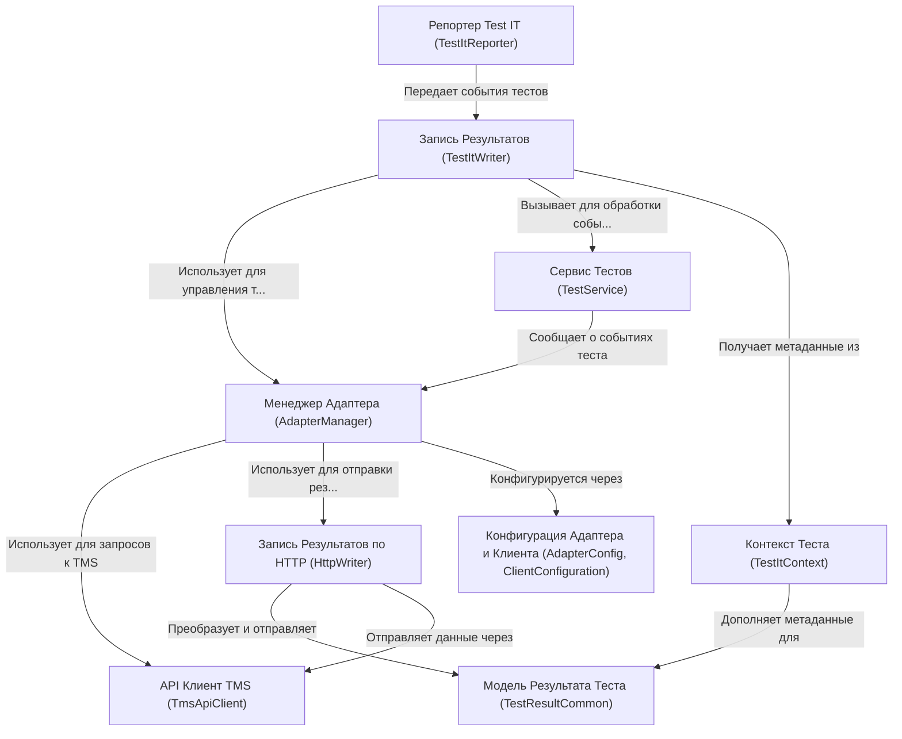

# Tutorial: adapters-kotlin

Этот проект предоставляет *адаптеры* для интеграции **Kotlin** фреймворков тестирования, таких как **Kotest**, с системой управления тестированием **Test IT TMS**.
Адаптеры автоматически *перехватывают* результаты выполнения автотестов (успех, падение, шаги, вложения) и отправляют их в Test IT для *управления тестовыми запусками* и анализа.

**Source Repository:** [https://github.com/testit-tms/adapters-kotlin](https://github.com/testit-tms/adapters-kotlin)

## Chapters

1. [Менеджер Адаптера (AdapterManager)
](01_менеджер_адаптера__adaptermanager__.md)
2. [Конфигурация Адаптера и Клиента (AdapterConfig, ClientConfiguration)
](02_конфигурация_адаптера_и_клиента__adapterconfig__clientconfiguration__.md)
3. [Репортер Test IT (TestItReporter)
](03_репортер_test_it__testitreporter__.md)
4. [Запись Результатов (TestItWriter)
](04_запись_результатов__testitwriter__.md)
5. [Сервис Тестов (TestService)
](05_сервис_тестов__testservice__.md)
6. [Контекст Теста (TestItContext)
](06_контекст_теста__testitcontext__.md)
7. [Модель Результата Теста (TestResultCommon)
](07_модель_результата_теста__testresultcommon__.md)
8. [Запись Результатов по HTTP (HttpWriter)
](08_запись_результатов_по_http__httpwriter__.md)
9. [API Клиент TMS (TmsApiClient)
](09_api_клиент_tms__tmsapiclient__.md)

---

Generated by [AI Codebase Knowledge Builder](https://github.com/The-Pocket/Tutorial-Codebase-Knowledge)